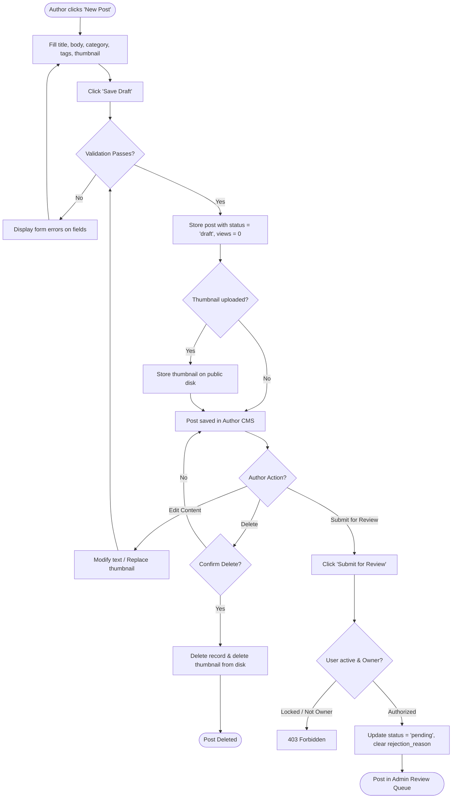
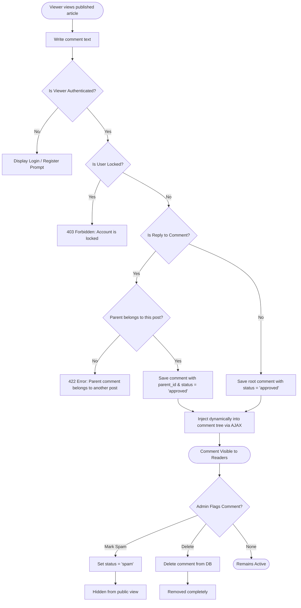

# BlogMNM — Activity Diagrams

This document contains UML Activity Diagrams depicting the end-to-end decision logic, branching conditions, and state transitions for the four primary workflows in BlogMNM.

---

## 1. Activity Diagram: Author Publishing & Editorial Revision Workflow



---

## 2. Activity Diagram: Administrator Post Moderation Workflow

```mermaid
flowchart TD
    StartAdmin([Admin visits /admin/posts]) --> SelectPost[Select pending post to review]
    SelectPost --> InspectPost[Read content, tags, author, thumbnail]
    InspectPost --> Decision{Editorial Decision?}
    
    Decision -- Approve --> ClickApprove[Click 'Approve']
    ClickApprove --> ProcessApproval[Set status = 'published'<br/>Set reviewed_by = admin.id<br/>Set reviewed_at = now()<br/>Set published_at = now()]
    ProcessApproval --> LiveFeed[Post immediately visible in public home feed]
    LiveFeed --> EndApprove([Published])
    
    Decision -- Reject --> OpenModal[Open Rejection Feedback Modal]
    OpenModal --> EnterReason[Enter constructive feedback reason]
    EnterReason --> ClickReject[Click 'Reject Post']
    ClickReject --> ProcessRejection[Set status = 'rejected'<br/>Set reviewed_by = admin.id<br/>Set reviewed_at = now()<br/>Save rejection_reason]
    ProcessRejection --> NotifyAuthor[Rejection visible to Author in CMS]
    NotifyAuthor --> AuthorRevise[Author revises content & resubmits]
    AuthorRevise --> SelectPost
    
    Decision -- Delete --> ClickDelete[Click 'Delete Post']
    ClickDelete --> ProcessDelete[Delete post & unlink thumbnail]
    ProcessDelete --> EndDelete([Post Permanently Removed])
```

---

## 3. Activity Diagram: Viewer Comment & Moderation Workflow



---

## 4. Activity Diagram: User Account Locking & Governance

```mermaid
flowchart TD
    StartGov([Admin visits /admin/users]) --> SearchUser[Locate abusive user]
    SearchUser --> ClickLock[Click 'Lock User']
    ClickLock --> VerifyAdmin{Target role == 'admin'?}
    
    VerifyAdmin -- Yes (SEC-05) --> BlockLockout[Reject Action: Administrators cannot be locked]
    BlockLockout --> FlashError[Show warning flash banner] --> DoneAbort([Action Blocked])
    
    VerifyAdmin -- No --> SetLocked[Update is_locked = true in database]
    SetLocked --> FlashSuccess[Show 'User account locked' notice]
    
    SetLocked -. Next User Request .-> LockedUserAttempt[Locked user tries any action]
    LockedUserAttempt --> ActionType{Action Type?}
    
    ActionType -- Login Attempt --> EjectSession[Auth::logout, Invalidate Session, 422 Error]
    ActionType -- Write Post / Edit --> PolicyBlock[PostPolicy before() returns false -> 403 Forbidden]
    ActionType -- Post Comment --> ReqBlock[StoreCommentRequest returns false -> 403 Forbidden]
    ActionType -- Like / Favorite / Follow --> CtrlBlock[abort_if is_locked -> 403 Forbidden]
    ActionType -- Access Protected Route --> MWBlock[RoleMiddleware aborts 403 Forbidden]
```
