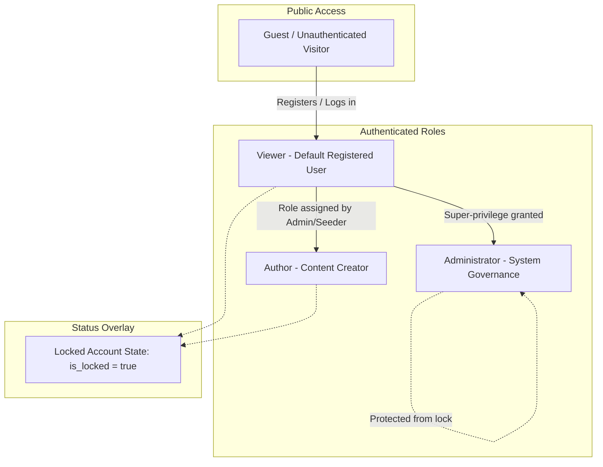

# BlogMNM — Actor Descriptions & Access Control Matrix

## 1. Overview

BlogMNM defines four distinct actors interacting with the platform. Each actor operates within a well-defined boundary of authentication, authorization policies, and interface layouts.

---

## 2. Actor Profiles

### 2.1 Guest (Unauthenticated Visitor)
- **Authentication State**: Unauthenticated (`auth()->check() === false`).
- **Core Motivation**: Discover high-quality articles, explore topics by category or tag, read author portfolios, and browse community discussions.
- **Allowed Actions**:
  - View public home feed (`/` or `/posts`).
  - Read published post details (`/posts/{slug}`).
  - Increment article view counter upon viewing post detail.
  - Search articles by keyword (`?q=keyword`).
  - Filter articles by category (`?category={slug}`) or tag (`?tag={slug}`).
  - View author public profile and published posts (`/authors/{id}`).
  - Browse paginated article archives.
  - Toggle light/dark interface theme (stored in `localStorage`).
  - Access `/login`, `/register`, `/forgot-password`.
- **Restricted / Forbidden Actions**:
  - Cannot like, bookmark, or follow (clicking prompts or redirects to `/login`).
  - Cannot post comments or replies.
  - Cannot access author CMS (`/posts/create`, `/author/posts/stats`) $\to$ HTTP 302 to login.
  - Cannot access administrative dashboard (`/admin/*`) $\to$ HTTP 302 to login.
  - Cannot view draft, pending, or rejected posts $\to$ HTTP 404 Not Found.

### 2.2 Viewer (Standard Authenticated Member)
- **Role Identifier**: `role = 'viewer'`.
- **Authentication State**: Authenticated session cookie via Laravel Breeze.
- **Core Motivation**: Consume articles, engage socially with the community, bookmark articles for future reading, and follow favorite authors.
- **Allowed Actions**:
  - All Guest capabilities.
  - Like or unlike any published post via optimistic AJAX toggle (`POST /posts/{id}/like`).
  - Bookmark or remove posts from personal favorites (`POST /posts/{id}/favorite`).
  - View personal bookmarked articles collection (`GET /favorites`).
  - Follow or unfollow authors (`POST /authors/{id}/follow`).
  - Submit root comments on published posts (`POST /posts/{id}/comments`).
  - Submit threaded replies to existing comments on the same post.
  - View personal activity stream (`GET /activity`).
  - Manage personal profile (name, email, password) and delete account (`/profile`).
- **Restricted / Forbidden Actions**:
  - Cannot create, edit, or submit blog posts $\to$ HTTP 403 Forbidden via `RoleMiddleware`.
  - Cannot access Author stats dashboard $\to$ HTTP 403 Forbidden.
  - Cannot access Admin portal $\to$ HTTP 403 Forbidden.
  - Cannot follow self $\to$ HTTP 422 Unprocessable Entity.
  - Cannot reply to a comment belonging to a different post $\to$ HTTP 422.

### 2.3 Author (Content Creator)
- **Role Identifier**: `role = 'author'`.
- **Authentication State**: Authenticated session cookie.
- **Core Motivation**: Author engaging articles, upload cover art, organize posts with categories and tags, submit drafts for editorial review, track reader engagement metrics.
- **Allowed Actions**:
  - All Viewer capabilities.
  - Access Author CMS creation interface (`GET /posts/create`).
  - Create new posts with title, summary excerpt, body, category, tags, and featured thumbnail (`POST /posts`).
  - Edit and update their own posts (`GET /posts/{id}/edit`, `PUT /posts/{id}`).
  - Delete their own posts (`DELETE /posts/{id}`), automatically unlinking associated thumbnails.
  - Submit own draft or rejected posts for review (`POST /posts/{id}/submit`).
  - View author analytics dashboard (`GET /author/posts/stats`) displaying metrics across their post portfolio.
  - View rejection reason feedback provided by editors to refine and resubmit posts.
- **Restricted / Forbidden Actions**:
  - Cannot edit, update, delete, or submit other authors' posts $\to$ HTTP 403 Forbidden via `PostPolicy`.
  - Cannot directly publish own posts without administrative review $\to$ status parameter tampering stripped.
  - Cannot access Admin dashboard or administrative moderation queues $\to$ HTTP 403 Forbidden.

### 2.4 Administrator (System Governance & Editor)
- **Role Identifier**: `role = 'admin'`.
- **Authentication State**: Authenticated session cookie.
- **Core Motivation**: Ensure content quality, moderate discussions, govern users, and maintain system taxonomy.
- **Allowed Actions**:
  - All Viewer and Author capabilities.
  - Access central Admin portal (`GET /admin` / `GET /admin/dashboard`).
  - Review pending posts queue (`GET /admin/posts`).
  - Approve pending posts for immediate publication (`POST /admin/posts/{id}/approve`).
  - Reject pending posts with constructive feedback notes (`POST /admin/posts/{id}/reject`).
  - Delete any post across the platform (`DELETE /admin/posts/{id}`).
  - Moderate comments queue (`GET /admin/comments`): approve comments, mark as spam, or permanently delete.
  - Manage categories (`GET /admin/categories`): create, edit, update, and delete categories (with post-retention safety checks).
  - Manage users (`GET /admin/users`): inspect user accounts, lock abusive users, and unlock accounts.
- **Special Safeguards**:
  - Cannot lock other Administrator accounts (`SEC-05`).
  - Cannot delete categories that have active posts assigned (`SEC-06`).

---

## 3. Account State: Locked (`is_locked = true`)

When an account is flagged with `is_locked = true`, defense-in-depth enforcement immediately restricts their actions:
1. **Authentication Level**: Attempting to log in triggers session destruction and returns a validation error (`AUTH-07`).
2. **Middleware Level**: `RoleMiddleware` checks `!$request->user()->is_locked`. Active sessions attempting to hit protected routes receive HTTP 403 Forbidden.
3. **Policy Level**: `PostPolicy::create()` and `PostPolicy::update()` explicitly return `false` if `$user->is_locked` (`ROLE-11`).
4. **FormRequest Level**: `StorePostRequest` and `StoreCommentRequest` verify `!$this->user()->is_locked`.
5. **Interaction Level**: `InteractionController` aborts with `403 Account is locked` on like, favorite, and follow actions.

---

## 4. Master Actor Permission Matrix

| Feature / Action | Guest | Viewer | Author | Administrator |
| :--- | :---: | :---: | :---: | :---: |
| **Browse Public Feed** | ✅ | ✅ | ✅ | ✅ |
| **Search & Filter Articles** | ✅ | ✅ | ✅ | ✅ |
| **Read Published Post** | ✅ | ✅ | ✅ | ✅ |
| **Toggle Light / Dark Theme**| ✅ | ✅ | ✅ | ✅ |
| **Register & Login** | ✅ | N/A | N/A | N/A |
| **Like / Unlike Post** | ❌ (Login prompt) | ✅ | ✅ | ✅ |
| **Bookmark / Favorite Post** | ❌ (Login prompt) | ✅ | ✅ | ✅ |
| **View Favorites Library** | ❌ (302 Redirect) | ✅ | ✅ | ✅ |
| **Follow / Unfollow Author** | ❌ (Login prompt) | ✅ | ✅ | ✅ |
| **Post Root Comment** | ❌ (Login prompt) | ✅ | ✅ | ✅ |
| **Post Threaded Reply** | ❌ (Login prompt) | ✅ | ✅ | ✅ |
| **Edit Profile & Password** | ❌ | ✅ | ✅ | ✅ |
| **Create Draft Post** | ❌ | ❌ (403) | ✅ | ✅ |
| **Edit Own Post** | ❌ | ❌ (403) | ✅ | ✅ |
| **Submit Post for Review** | ❌ | ❌ (403) | ✅ | ✅ |
| **View Author Stats** | ❌ | ❌ (403) | ✅ | ✅ |
| **Edit Others' Posts** | ❌ | ❌ (403) | ❌ (403) | ✅ |
| **Approve / Reject Posts** | ❌ | ❌ (403) | ❌ (403) | ✅ |
| **Moderate Comments (Spam/Approve)** | ❌ | ❌ (403) | ❌ (403) | ✅ |
| **Manage Categories** | ❌ | ❌ (403) | ❌ (403) | ✅ |
| **Lock / Unlock Users** | ❌ | ❌ (403) | ❌ (403) | ✅ |
| **Access Admin Dashboard** | ❌ (302 Redirect) | ❌ (403) | ❌ (403) | ✅ |
