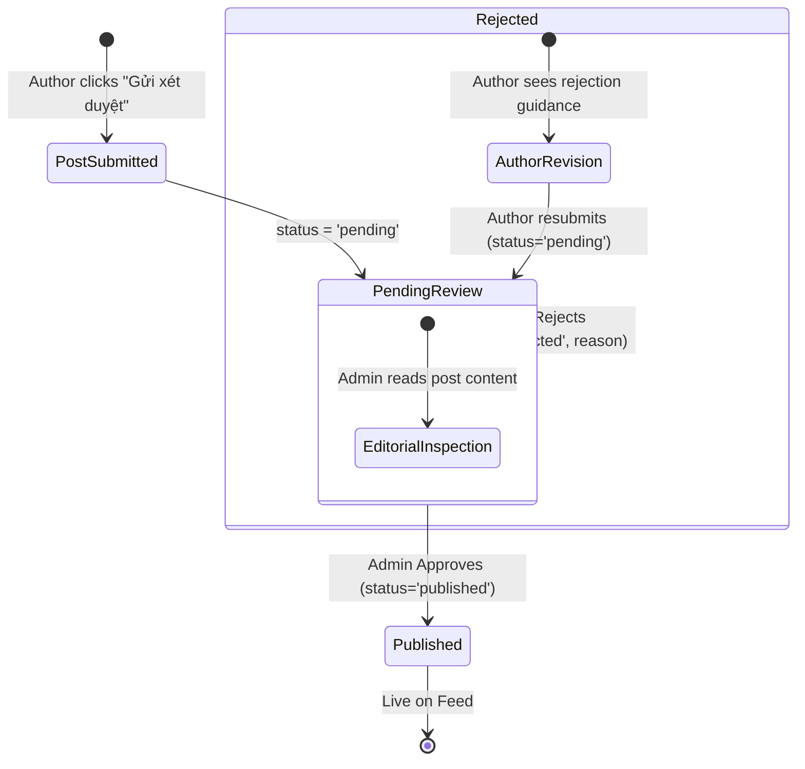
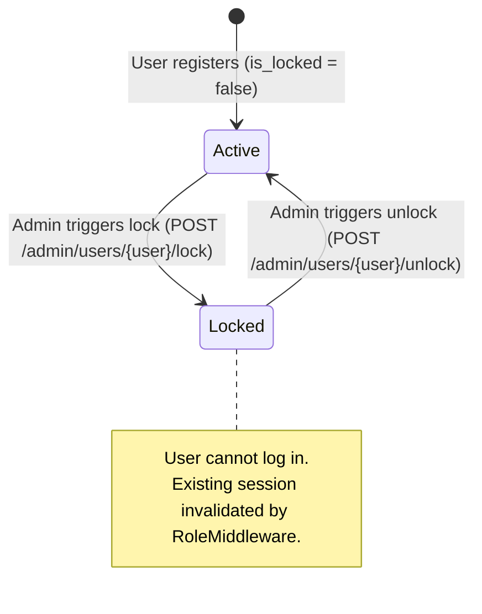
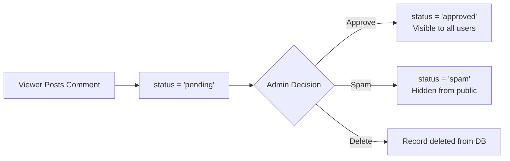

# BlogMNM — Editorial & Administrative Moderation Workflows

## 1. Overview
The Administrative Workflow oversees content gatekeeping and user compliance. It coordinates editorial decision-making between Authors and Administrators, ensuring platform quality and safety.

---

## 2. Global Moderation State Machine

---

## 3. Post Moderation State Transition Matrix

| Action | Prior State | Target State | Mutated Attributes | Trigger Endpoint | Actor |
|---|---|---|---|---|---|
| **Approve** | `pending` | `published` | `status = 'published'` `reviewed_by = admin_id` `reviewed_at = NOW()` `published_at = NOW()` | `POST /admin/posts/{post}/approve` | Admin Only |
| **Reject** | `pending` | `rejected` | `status = 'rejected'` `rejection_reason = <text>` `reviewed_by = admin_id` `reviewed_at = NOW()` | `POST /admin/posts/{post}/reject` | Admin Only |
| **Resubmit**| `rejected` | `pending` | `status = 'pending'` | `POST /posts/{post}/submit` | Author (Owner) |
| **Delete** | Any | *Deleted* | Record removed, disk thumbnail deleted | `DELETE /admin/posts/{post}` | Admin Only |

---

## 4. User Moderation Lifecycle (Lock / Unlock)

- When locked (`is_locked = true`), user attempts to authenticate or interact trigger HTTP `403 Forbidden` or redirect to login.
- Admins are forbidden from locking their own account to prevent administrative deadlocks.

---

## 5. Comment Moderation Flow

