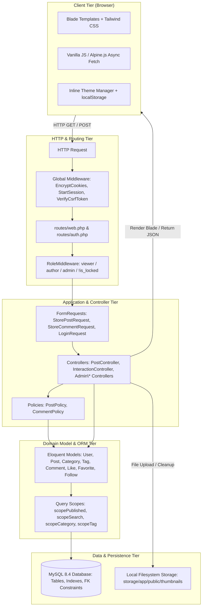
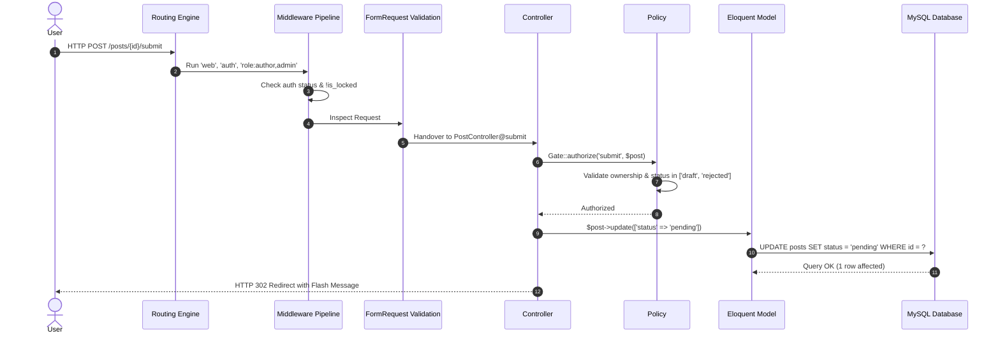

# BlogMNM — Software Architecture Document

## 1. Architectural Style & Principles

**BlogMNM** follows the classic **Model-View-Controller (MVC)** architectural pattern enriched with dedicated **FormRequest Validation**, **Model Policies**, and **Role-Based Middleware** layers. The architecture is engineered around the following core design principles:

1. **Separation of Concerns (SoC)**: Controllers handle HTTP coordination; FormRequests manage input validation and pre-validation sanitization; Policies enforce authorization rules; Eloquent Models encapsulate domain logic and relationship graphs; Blade views manage UI presentation.
2. **Defense-in-Depth Security**: Access control is validated at routing (middleware), HTTP request entry (FormRequest), authorization checks (Policies), and database constraints (foreign keys & unique indexes).
3. **Stateless Frontend / Stateful Backend**: Traditional Blade SSR paired with modern, unobtrusive JavaScript (Alpine.js & native `fetch`) for micro-interactions (like/favorite toggling, comments injection, theme switching).

---

## 2. High-Level Architecture Diagram

---

## 3. Layer Breakdown

### 3.1 Presentation Layer (Views & Assets)
- **Blade Templating**: Component-driven architecture located in `resources/views/components/` (`post-card`, `sidebar`, `mobile-nav`, `primary-button`, `secondary-button`, `modal`).
- **Tailwind CSS System**: Built on centralized CSS variables (`--color-bg`, `--color-surface`, `--color-border`, `--color-text`, `--color-text-secondary`, `--color-input`) in `resources/css/app.css` for consistent dark and light theming.
- **Client Interactions**: `resources/js/interactions.js` provides optimistic DOM updates for likes, bookmark saves, follow toggles, and dynamic comment rendering without page reloads.

### 3.2 Routing & Middleware Layer
- **Route Definitions**: Split into `routes/web.php` (public, author, and admin routes) and `routes/auth.php` (Breeze authentication flows).
- **Middleware Pipeline**:
  - `web`: Session start, cookie encryption, CSRF verification.
  - `auth`: Guarantees user is authenticated.
  - `role:{roles}`: Custom `App\Http\Middleware\RoleMiddleware` validating user role membership and asserting `!$request->user()->is_locked`.

### 3.3 Request Validation & Sanitization Layer
- Located in `app/Http/Requests/`:
  - `StorePostRequest`: Enforces post content rules, image validation (`mimes:jpg,jpeg,png,webp|max:2048`), and executes `prepareForValidation()` to strip any injected `status` attributes.
  - `StoreCommentRequest`: Validates body length (2 to 2000 characters) and executes cross-post verification on `parent_id`.
  - `Auth\LoginRequest`: Handles email normalization, rate limiting (5 attempts/min), and locked account ejection.

### 3.4 Controller Layer
- **Public & Viewer Controllers**:
  - `PostController`: Serves home feed, search, category filter, author post listings, and article detail view with atomic view counting.
  - `InteractionController`: Handles JSON endpoints for likes, favorites, and author following.
  - `CommentController`: Manages root comment and reply creation and deletion.
  - `FavoriteController`: Renders the user's saved article bookmarks.
  - `ProfileController`: Manages personal profile edits, password updates, and account deletion.
- **Administrative Controllers (`app/Http/Controllers/Admin/`)**:
  - `DashboardController`: Aggregates system-wide metrics and pipeline counts.
  - `PostController`: Manages post moderation queue (approve, reject with notes, delete).
  - `CommentController`: Manages comment moderation queue (approve, mark spam, hard delete).
  - `CategoryController`: Manages taxonomy categories with deletion protection.
  - `UserController`: Manages user directory and account locking/unlocking.

### 3.5 Authorization & Policy Layer
- `PostPolicy`: Enforces post ownership for editing, updating, deleting, and submitting (`$user->id === $post->user_id`). Blocks locked authors (`$user->is_locked`).
- `CommentPolicy`: Enforces comment deletion privileges (author of comment or admin).

### 3.6 Persistence & Filesystem Storage Layer
- **Database**: Relational MySQL with InnoDB engine enforcing foreign key cascades and deletion restrictions (`RESTRICT` on `categories.id` from `posts.category_id`).
- **Filesystem**: Standard Laravel `public` storage disk (`storage/app/public/thumbnails`) exposed via symbolic link to `public/storage`. Automatic unlinking of stale images managed in controller actions and model lifecycle hooks.

---

## 4. Request Lifecycle Sequence

---

## 5. Security Architecture

1. **Cross-Site Request Forgery (CSRF)**: All state-changing endpoints require valid CSRF tokens (`@csrf` in Blade or `X-CSRF-TOKEN` in AJAX headers).
2. **Cross-Site Scripting (XSS)**: Blade's `{{ ... }}` auto-escapes all dynamic variables using `htmlspecialchars()`. Unescaped output (`{!! ... !!}`) is restricted to sanitized Markdown/HTML post bodies.
3. **Mass Assignment Protection**: Models declare strict `$fillable` arrays. Sensitive flags (`is_locked`, `role`) are protected from unprivileged modification.
4. **SQL Injection**: All database queries are executed using PDO prepared statements via Eloquent ORM. Raw SQL queries are avoided.
5. **Rate Limiting**: Critical endpoints (Login) implement rate limiters to prevent credential stuffing.
6. **File Upload Security**: Thumbnail uploads validate MIME types (`jpg,jpeg,png,webp`), file sizes ($\le 2\text{MB}$), and store files with randomized hash names to prevent directory traversal or remote code execution.
