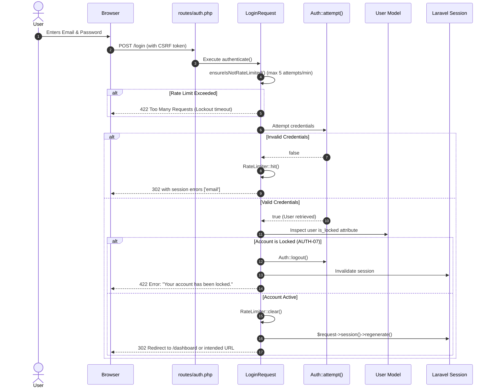

# BlogMNM — Authentication Architecture & Flow

## 1. Overview
Authentication in BlogMNM is built on **Laravel Breeze (Blade Stack)**, delivering a secure, session-based stateful authentication system. It includes brute-force rate limiting, session fixation protection, and active account lock verification.



---

## 2. Authentication Subsystems

### 2.1 User Registration
- **Route**: `POST /register` $\to$ `RegisteredUserController@store`
- **Validation**:
  ```php
  $request->validate([
      'name' => ['required', 'string', 'max:255'],
      'email' => ['required', 'string', 'lowercase', 'email', 'max:255', 'unique:'.User::class],
      'password' => ['required', 'confirmed', Rules\Password::defaults()],
  ]);
  ```
- **Privilege Whitelist**: Role is strictly assigned as `'viewer'` via database schema defaults and model configuration. Direct parameter tampering attempting to pass `role = 'admin'` is rejected.
- **Session Startup**: Logs user in immediately via `Auth::login($user)` and fires `Registered` event.

### 2.2 Login & Security Defenses
- **Route**: `POST /login` $\to$ `AuthenticatedSessionController@store`
- **Rate Limiting**: Managed in `App\Http\Requests\Auth\LoginRequest`:
  - Cache key: `Str::transliterate(Str::lower($this->input('email')).'|'.$this->ip())`.
  - Max attempts: 5 per 60 seconds.
- **Session Fixation Defense**: Executes `$request->session()->regenerate()` upon valid authentication.
- **Locked User Interception (`AUTH-07`)**:
  ```php
  if (Auth::user()?->is_locked) {
      Auth::logout();
      throw ValidationException::withMessages([
          'email' => __('Your account has been locked by an administrator.'),
      ]);
  }
  ```

### 2.3 Logout & Session Cleanup
- **Route**: `POST /logout` $\to$ `AuthenticatedSessionController@destroy`
- **Cleanup Routine**:
  ```php
  Auth::guard('web')->logout();
  $request->session()->invalidate();
  $request->session()->regenerateToken();
  ```
- Prevents back-button session caching and invalidates existing CSRF tokens.

### 2.4 Password Management Pipeline
- **Forgot Password**: Generates cryptographic token saved in `password_reset_tokens` table.
- **Reset Password**: Validates token expiry, hashes new password via `Hash::make()`, resets remember token, and notifies user.
- **In-App Password Update**: `PUT /password` (`PasswordController@update`) verifies `current_password` before updating the hash.
