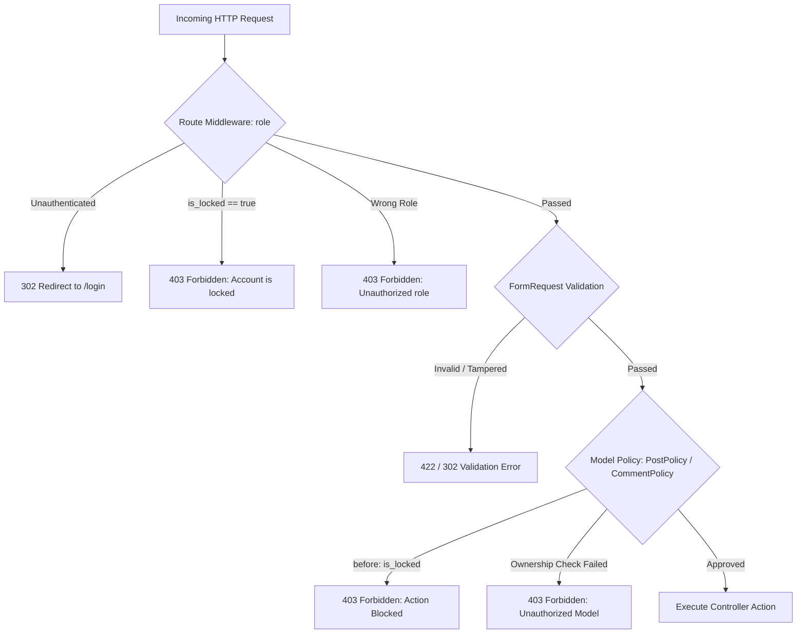

# BlogMNM — Authorization Architecture & Access Control Flow

## 1. Role Hierarchy & Access Tiers

BlogMNM implements strict Role-Based Access Control (RBAC) structured across four user tiers:

| Role | Authentication | Primary Scope & Access Boundaries |
| :--- | :--- | :--- |
| **Guest** | Unauthenticated | Browse public feeds, search, view post detail & comments. No write or mutation rights. |
| **Viewer** | Authenticated (`role = 'viewer'`) | All Guest abilities + write comments, replies, like posts, favorite bookmarks, and follow authors. |
| **Author** | Authenticated (`role = 'author'`) | All Viewer abilities + access Author CMS (`/posts/create`, `/author/posts/stats`), draft posts, edit/delete owned posts, submit posts for editorial review. |
| **Admin** | Authenticated (`role = 'admin'`) | Superuser. Access Admin portal (`/admin`), review & approve/reject posts, moderate comments, manage categories (with integrity constraints), lock/unlock users. |

---

## 2. Multi-Layer Authorization Architecture

Authorization is enforced at multiple layers to achieve defense-in-depth:



---

## 3. Middleware Layer (`RoleMiddleware`)

Registered as route alias `'role'` in `bootstrap/app.php`:
```php
$middleware->alias([
    'role' => \App\Http\Middleware\RoleMiddleware::class,
]);
```

### Logic & Lock Verification
```php
public function handle(Request $request, Closure $next, ...$roles): Response
{
    $allowedRoles = [];
    foreach ($roles as $role) {
        $allowedRoles = array_merge($allowedRoles, explode(',', $role));
    }

    if (! $request->user() 
        || ! in_array($request->user()->role, $allowedRoles, true) 
        || $request->user()->is_locked) {
        abort(403);
    }

    return $next($request);
}
```

---

## 4. Policy Layer (`PostPolicy` & `CommentPolicy`)

### `PostPolicy` Implementation
Domain authorization rules for post management are encapsulated in `App\Policies\PostPolicy`:

- **Pre-authorization hook (`before`)**:
  ```php
  public function before(User $user, string $ability): ?bool
  {
      if ($user->is_locked) {
          return false; // Intercepts all abilities for locked users (ROLE-11)
      }

      if ($user->isAdmin()) {
          return true; // Superuser access
      }

      return null;
  }
  ```
- **Post Ownership & State Guards**:
  - `create(User $user)`: `$user->isAuthor()`
  - `update(User $user, Post $post)`: `$user->id === $post->user_id`
  - `delete(User $user, Post $post)`: `$user->id === $post->user_id`
  - `submit(User $user, Post $post)`: `$user->id === $post->user_id && in_array($post->status, ['draft', 'rejected'], true)`

### `CommentPolicy` Implementation
Enforces deletion rules in `App\Policies\CommentPolicy`:
- `delete(User $user, Comment $comment)`: `$user->id === $comment->user_id || $user->isAdmin()`

---

## 5. Master Authorization Security Matrix

| Action | Guest | Viewer | Author (Owner) | Author (Non-Owner) | Administrator |
| :--- | :---: | :---: | :---: | :---: | :---: |
| **Browse Home Feed** | ✅ | ✅ | ✅ | ✅ | ✅ |
| **Read Published Article** | ✅ | ✅ | ✅ | ✅ | ✅ |
| **Read Draft/Pending Article** | ❌ (404) | ❌ (404) | ✅ | ❌ (404) | ✅ |
| **Like / Favorite Post** | ❌ (Prompt) | ✅ | ✅ | ✅ | ✅ |
| **Follow Author** | ❌ (Prompt) | ✅ (Not self) | ✅ (Not self) | ✅ (Not self) | ✅ (Not self) |
| **Post Root Comment / Reply** | ❌ (Prompt) | ✅ | ✅ | ✅ | ✅ |
| **Access `/posts/create`** | ❌ (302) | ❌ (403) | ✅ | ✅ | ✅ |
| **Create Draft Post** | ❌ (302) | ❌ (403) | ✅ | ✅ | ✅ |
| **Edit Post** | ❌ (302) | ❌ (403) | ✅ | ❌ (403) | ✅ |
| **Delete Post** | ❌ (302) | ❌ (403) | ✅ | ❌ (403) | ✅ |
| **Submit Post for Review** | ❌ (302) | ❌ (403) | ✅ (Draft/Rejected) | ❌ (403) | ✅ |
| **Approve / Reject Post** | ❌ (302) | ❌ (403) | ❌ (403) | ❌ (403) | ✅ |
| **Moderate Comments Queue** | ❌ (302) | ❌ (403) | ❌ (403) | ❌ (403) | ✅ |
| **Manage Categories** | ❌ (302) | ❌ (403) | ❌ (403) | ❌ (403) | ✅ |
| **Lock / Unlock Users** | ❌ (302) | ❌ (403) | ❌ (403) | ❌ (403) | ✅ (Not peers) |
| **Access Admin Dashboard** | ❌ (302) | ❌ (403) | ❌ (403) | ❌ (403) | ✅ |
