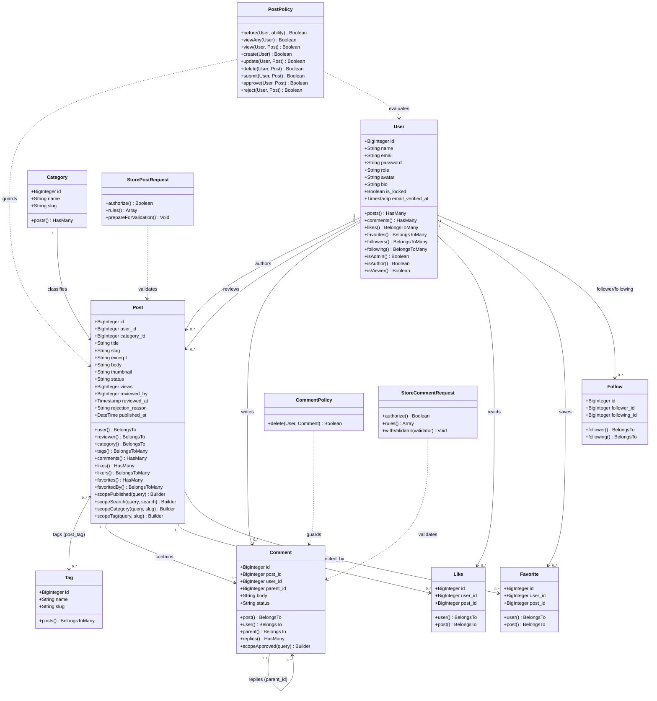

# BlogMNM — Domain Model Class Diagram

## 1. Overview
This document models the object-oriented structure of BlogMNM, depicting all Eloquent models, their relationships, attributes, query scopes, and interactions with Laravel Policies and FormRequests.

---

## 2. UML Class Diagram

---

## 3. Core Class Descriptions

### 3.1 Model Layer
- **`User`**: Core identity model supporting role checks (`isAdmin()`, `isAuthor()`, `isViewer()`) and lockout state (`is_locked`). Defines bidirectional social relationships (`followers`, `following`).
- **`Post`**: Main publication model. Encapsulates query scopes for public viewing (`scopePublished`), keyword filtering (`scopeSearch`), and taxonomy queries (`scopeCategory`, `scopeTag`). Implements `Post::booted()` deletion observer for thumbnail unlinking.
- **`Category`**: Taxonomy container. Foreign key on `posts.category_id` is set to `RESTRICT` on delete to protect data integrity.
- **`Tag`**: Taxonomy keyword container linked via `post_tag` pivot.
- **`Comment`**: Threaded discussion entity. Contains `parent_id` for nested replies and `status` (`pending`, `approved`, `spam`) for moderation.
- **`Like`**, **`Favorite`**, **`Follow`**: Relational join models with composite unique indexes preventing duplicate interactions.

### 3.2 Security & Validation Layer
- **`PostPolicy`**: Enforces model-level access rules and locks down mutations for locked user accounts.
- **`CommentPolicy`**: Enforces comment deletion privileges.
- **`StorePostRequest`**: Strips client-injected status parameters and validates thumbnail uploads.
- **`StoreCommentRequest`**: Validates comment body and cross-post parent integrity.
