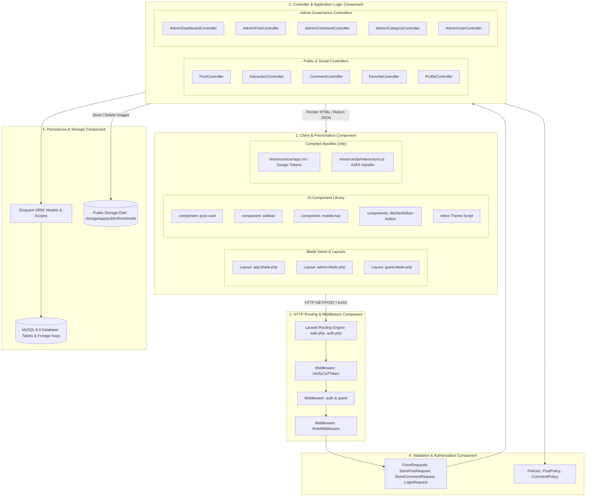

# BlogMNM — System Component Diagram

## 1. Overview
This document illustrates the modular software components comprising the BlogMNM application, their interfaces, dependencies, and data flow across the client, presentation, business logic, authorization, and persistence tiers.

---

## 2. UML Component Diagram

---

## 3. Component Details & Boundaries

### 3.1 Client & Presentation Component
- **Blade Components**: Reusable UI primitives isolated in `resources/views/components/`. 
  - `sidebar.blade.php` and `mobile-nav.blade.php` dynamically render links based on user role and auth status.
  - `post-card.blade.php` encapsulates author avatar, taxonomy badges, article excerpt, thumbnail, view counters, and interactive buttons.
- **Client Scripting**: `resources/js/interactions.js` attaches event listeners to like, bookmark, follow, and comment forms, performing asynchronous `fetch()` requests and optimistically updating the DOM without page refresh.
- **Design Tokens**: Standardized CSS variables in `resources/css/app.css` ensure consistent theming across all components.

### 3.2 Routing & Middleware Component
- **Route Definitions**: Centrally declared in `routes/web.php` and `routes/auth.php`.
- **Middleware Pipeline**:
  - `web` group: Cookie encryption, session management, CSRF token verification.
  - `auth`: Redirects unauthenticated visitors to `/login`.
  - `role:{roles}`: Verifies user role and intercepts locked users (`!$user->is_locked`).

### 3.3 Controller Component
- **Public & Social Controllers**: Manages feed pagination, search querying, atomic view tracking, and social interaction endpoints.
- **Admin Controllers**: Isolated under `app/Http/Controllers/Admin/`. Encapsulates administrative moderation workflows (post approval/rejection, comment spam triage, user locking, category management).

### 3.4 Validation & Authorization Component
- **FormRequests**: Validates request structure, enforces file upload restrictions (images $\le 2\text{MB}$), and scrubs sensitive workflow attributes before controller execution.
- **Policies**: Enforces fine-grained model ownership rules and intercepts locked user accounts at the gate.

### 3.5 Persistence & Storage Component
- **Eloquent ORM**: Hydrates models, manages relationships (`hasMany`, `belongsToMany`), and executes parameterized SQL queries.
- **MySQL Database**: Enforces relational data integrity (`RESTRICT` on category deletion, cascade on likes/favorites/comments, unique composite keys).
- **Public Disk**: Manages uploaded thumbnails under `storage/app/public/thumbnails/` with automated cleanup hooks on model deletion.
