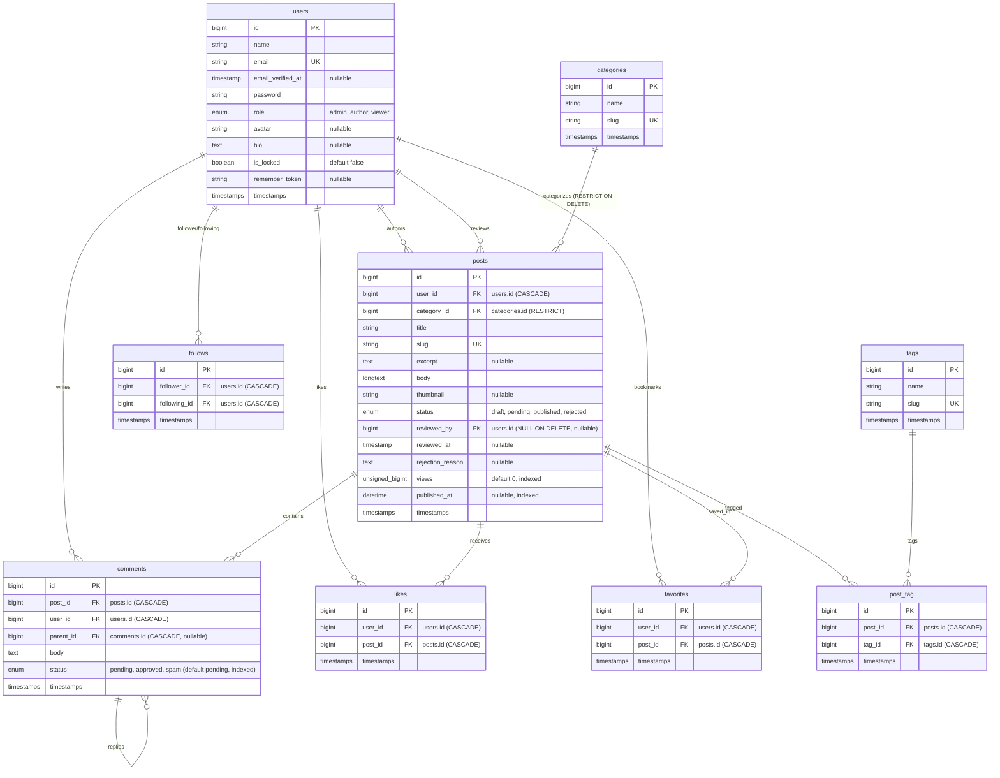

# BlogMNM — Database Schema Specification

## 1. Architectural Overview & ER Diagram

BlogMNM uses a relational database schema designed for high data integrity, performant indexing, and complete adherence to the system data contract.

---

## 2. Table Specifications & Relationships

### `users`
- **Primary Key**: `id` (bigint unsigned auto-increment)
- **Unique**: `email`
- **Defaults**: `role` = `'viewer'`, `is_locked` = `false`
- **Relations**:
  - `hasMany(Post::class)` — posts authored.
  - `hasMany(Comment::class)` — comments posted.
  - `belongsToMany(Post::class, 'favorites')` — bookmarked posts.
  - `belongsToMany(Post::class, 'likes')` — liked posts.
  - `belongsToMany(User::class, 'follows', 'follower_id', 'following_id')` — authors followed.
  - `belongsToMany(User::class, 'follows', 'following_id', 'follower_id')` — user followers.

### `categories`
- **Primary Key**: `id`
- **Unique**: `slug`
- **Relations**:
  - `hasMany(Post::class)`
- **Integrity Rule**: Foreign key constraint from `posts` is configured with `RESTRICT ON DELETE` (`2024_01_01_000010`). Prevents category deletion when active posts exist (`SEC-06`).

### `tags`
- **Primary Key**: `id`
- **Unique**: `slug`
- **Relations**:
  - `belongsToMany(Post::class, 'post_tag')`

### `posts`
- **Primary Key**: `id`
- **Foreign Keys**:
  - `user_id` references `users(id)` ON DELETE CASCADE
  - `category_id` references `categories(id)` ON DELETE RESTRICT
  - `reviewed_by` references `users(id)` ON DELETE SET NULL (nullable)
- **Unique**: `slug`
- **Indexes**:
  - `index('status')` — rapid filtering of published vs pending posts.
  - `index('published_at')` — accelerates chronological queries.
  - `index('views')` — optimizes popular posts ordering.
- **Audit Columns**:
  - `reviewed_by`: user ID of administrator who reviewed the post.
  - `reviewed_at`: timestamp of approval or rejection.
  - `rejection_reason`: text feedback supplied when post is rejected.
- **Relations**:
  - `belongsTo(User::class, 'user_id')`
  - `belongsTo(User::class, 'reviewed_by')`
  - `belongsTo(Category::class)`
  - `belongsToMany(Tag::class, 'post_tag')`
  - `hasMany(Comment::class)`
  - `hasMany(Like::class)` / `belongsToMany(User::class, 'likes')`
  - `hasMany(Favorite::class)` / `belongsToMany(User::class, 'favorites')`

### `post_tag`
- **Primary Key**: `id`
- **Foreign Keys**:
  - `post_id` references `posts(id)` ON DELETE CASCADE
  - `tag_id` references `tags(id)` ON DELETE CASCADE
- **Unique Constraint**: `['post_id', 'tag_id']` prevents duplicate tagging.

### `comments`
- **Primary Key**: `id`
- **Foreign Keys**:
  - `post_id` references `posts(id)` ON DELETE CASCADE
  - `user_id` references `users(id)` ON DELETE CASCADE
  - `parent_id` references `comments(id)` ON DELETE CASCADE (nullable for top-level comments)
- **Indexes**:
  - `index('status')` — enables filtering by `'approved'`, `'pending'`, or `'spam'`.
- **Relations**:
  - `belongsTo(Post::class)`
  - `belongsTo(User::class)`
  - `hasMany(Comment::class, 'parent_id')` (replies)
  - `belongsTo(Comment::class, 'parent_id')` (parent comment)

### `favorites`
- **Primary Key**: `id`
- **Foreign Keys**:
  - `user_id` references `users(id)` ON DELETE CASCADE
  - `post_id` references `posts(id)` ON DELETE CASCADE
- **Unique Constraint**: `['user_id', 'post_id']` prevents duplicate bookmarks.

### `likes`
- **Primary Key**: `id`
- **Foreign Keys**:
  - `user_id` references `users(id)` ON DELETE CASCADE
  - `post_id` references `posts(id)` ON DELETE CASCADE
- **Unique Constraint**: `['user_id', 'post_id']` ensures exactly one like per user per post.

### `follows`
- **Primary Key**: `id`
- **Foreign Keys**:
  - `follower_id` references `users(id)` ON DELETE CASCADE
  - `following_id` references `users(id)` ON DELETE CASCADE
- **Unique Constraint**: `['follower_id', 'following_id']` prevents duplicate follow pairs.

---

## 3. Session & Cache Infrastructure Tables

### `sessions`
- **Columns**: `id` (PK, string), `user_id` (FK nullable, indexed), `ip_address` (string 45 nullable), `user_agent` (text nullable), `payload` (longtext), `last_activity` (integer, indexed).

### `cache` & `cache_locks`
- Standard Laravel database cache storage tables for rate limiting and temporary application caching.
