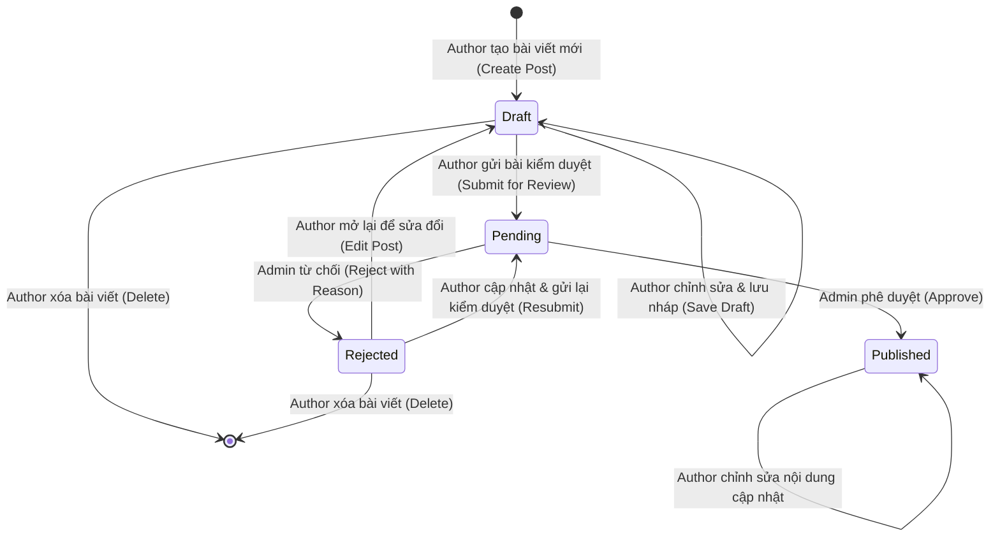
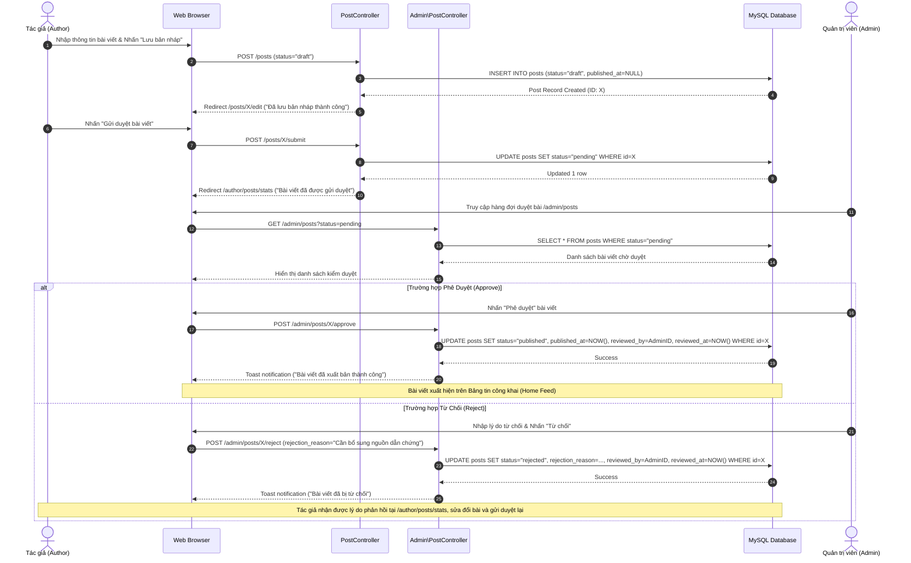

# Quy Trình Nghiệp Vụ Chính Thức (Business Workflow Option B) — BlogMNM

> **Phiên bản:** 2.0 — Final Official Release  
> **Quyết định chính thức:** Nhóm quyết định lựa chọn **Phương án B (Option B)** làm workflow nghiệp vụ chuẩn cho toàn bộ hệ thống BlogMNM.  
> **Nguyên tắc cốt lõi:** Tác giả (Author) **tuyệt đối KHÔNG** được tự xuất bản bài viết (`Draft -> Published`). Mọi bài viết muốn lên sóng công khai đều phải thông qua quy trình kiểm duyệt có trách nhiệm của Quản trị viên (Admin).

---

## 1. Tổng Quan Vòng Đời Bài Viết (Post Lifecycle States)

Hệ thống quản lý bài viết BlogMNM vận hành dựa trên máy trạng thái hữu hạn (Finite State Machine) gồm 4 trạng thái chuẩn hóa:

---

## 2. Chi Tiết Các Trạng Thái & Điều Kiện Chuyển Đổi

### 2.1. Trạng Thái `Draft` (Bản Nháp)
- **Mô tả:** Bài viết đang trong quá trình thai nghén hoặc biên tập cá nhân của Tác giả.
- **Ai nhìn thấy:** Chỉ duy nhất Tác giả sở hữu bài viết và Quản trị viên hệ thống. Khách vãng lai và Độc giả không thể xem trên bảng tin công khai (`/`, `/posts`).
- **Hành động khả dụng:**
  - Tác giả chỉnh sửa tiêu đề, danh mục, tóm tắt, nội dung, ảnh thumbnail, thẻ tags (`PUT /posts/{id}`).
  - Tác giả lưu lại nhiều lần mà không kích hoạt kiểm duyệt.
  - Tác giả chủ động bấm **"Gửi bài kiểm duyệt"** (`POST /posts/{id}/submit`) để chuyển sang trạng thái `Pending`.
  - Tác giả có thể xóa vĩnh viễn bài nháp (`DELETE /posts/{id}`).

### 2.2. Trạng Thái `Pending` (Chờ Duyệt)
- **Mô tả:** Bài viết đã hoàn thiện biên tập và được đưa vào hàng đợi kiểm duyệt tập trung của tòa soạn (`/admin/posts`).
- **Ai nhìn thấy:** Tác giả sở hữu (thấy trạng thái huy hiệu màu vàng tại trang thống kê `/author/posts/stats`) và Quản trị viên (tại màn hình duyệt bài `/admin/posts`).
- **Ràng buộc an toàn:**
  - Tác giả không thể tự chuyển thành `Published`.
  - Mọi trường dữ liệu kiểm duyệt (`reviewed_by`, `reviewed_at`, `published_at`) đều được bảo vệ nghiêm ngặt ở tầng backend (không cho phép client can thiệp qua form payload).
- **Hành động khả dụng:**
  - Quản trị viên đọc chi tiết bài viết và đánh giá chất lượng.
  - Quản trị viên nhấn **"Phê duyệt"** (`POST /admin/posts/{id}/approve`) -> Chuyển sang `Published`.
  - Quản trị viên nhập lý do và nhấn **"Từ chối"** (`POST /admin/posts/{id}/reject`) -> Chuyển sang `Rejected`.

### 2.3. Trạng Thái `Published` (Đã Xuất Bản)
- **Mô tả:** Bài viết chính thức được phát hành ra công chúng trên nền tảng BlogMNM.
- **Thời điểm kích hoạt:** Khi Admin phê duyệt, hệ thống tự động gán `published_at = now()`, `reviewed_by = admin->id`, `reviewed_at = now()`.
- **Ai nhìn thấy:** Toàn bộ người dùng Internet (Guest, Viewer, Author, Admin).
- **Tính năng tương tác mở:**
  - Tăng lượt xem thực tế khi có người đọc (`views`).
  - Độc giả có thể Thả tim (Like), Lưu bài viết (Bookmark/Favorite), Gửi bình luận và Trả lời thảo luận phân cấp (Replies).
  - Tác giả sở hữu bài viết có quyền điều duyệt/xóa các bình luận spam hoặc độc hại phát sinh trên bài viết của mình.

### 2.4. Trạng Thái `Rejected` (Bị Từ Chối)
- **Mô tả:** Bài viết không đạt tiêu chuẩn xuất bản (vi phạm quy định nội dung, thiếu dẫn chứng, chất lượng chưa đạt hoặc cần bổ sung hình ảnh).
- **Phản hồi cho Tác giả:** Admin bắt buộc phải cung cấp lý do từ chối cụ thể (`rejection_reason`).
- **Quyền của Tác giả:**
  - Tác giả đọc được chính xác phản hồi từ Ban biên tập trên trang `/author/posts/stats`.
  - Tác giả có thể nhấn **"Chỉnh sửa"** (`GET /posts/{id}/edit`) để hoàn thiện bài viết theo đúng góp ý của Admin.
  - Tác giả nhấn **"Gửi lại kiểm duyệt"** (`POST /posts/{id}/submit`) -> Chuyển ngược lại trạng thái `Pending`.
  - Tác giả có thể xóa bài viết nếu không muốn tiếp tục phát triển đề tài này.

---

## 3. Ma Trận Phân Quyền Vai Trò (Role & Permissions Matrix)

| Chức năng / Tác vụ | Khách (Guest) | Độc giả (Viewer) | Tác giả (Author) | Quản trị viên (Admin) |
|---|:---:|:---:|:---:|:---:|
| **Xem bảng tin công khai (`/`, `/posts`)** |  |  |  |  |
| **Tìm kiếm & Lọc theo Danh mục/Thẻ** |  |  |  |  |
| **Đọc bài viết `Published`** |  |  |  |  |
| **Thả tim (Like/Unlike)** | ❌ |  |  |  |
| **Lưu bài viết Yêu thích (Favorite)** | ❌ |  |  |  |
| **Theo dõi Tác giả (Follow)** | ❌ |  |  |  |
| **Gửi bình luận & Trả lời (Comments/Replies)** | ❌ |  |  |  |
| **Tự nâng cấp lên Tác giả (`become-author`)** | ❌ |  | N/A | N/A |
| **Soạn bài & Lưu bản nháp (`Draft`)** | ❌ | ❌ |  |  |
| **Chỉnh sửa bài viết của chính mình** | ❌ | ❌ |  |  |
| **Gửi duyệt / Gửi lại bài viết (`Pending`)** | ❌ | ❌ |  |  |
| **Tự ý chuyển bài sang `Published`** | ❌ | ❌ | **TUYỆT ĐỐI KHÔNG** | ❌ *(Phải qua duyệt)* |
| **Xóa bài viết của chính mình** | ❌ | ❌ |  |  |
| **Xóa bình luận spam trên bài viết của mình** | ❌ | ❌ |  |  |
| **Xem thống kê hiệu suất cá nhân (`stats`)** | ❌ | ❌ |  |  |
| **Phê duyệt bài viết (`Approve -> Published`)**| ❌ | ❌ | ❌ |  |
| **Từ chối bài viết (`Reject -> Rejected`)** | ❌ | ❌ | ❌ |  |
| **Quản trị toàn bộ bài viết hệ thống** | ❌ | ❌ | ❌ |  |
| **Quản trị bình luận toàn hệ thống (`/admin/comments`)**| ❌ | ❌ | ❌ |  |
| **Quản trị Danh mục (CRUD Categories)** | ❌ | ❌ | ❌ |  |
| **Khóa / Mở khóa người dùng (`Lock/Unlock`)**| ❌ | ❌ | ❌ |  |

---

## 4. Sơ Đồ Tuần Tự Kiểm Duyệt Bài Viết (Sequence Diagram)

---

## 5. Kết Luận & Cam Kết Thực Thi

1. **Tuân thủ triệt để Option B:** Bảo đảm tính chuyên nghiệp của hệ thống Blog/News chất lượng cao, ngăn chặn việc đăng tải bài viết tùy tiện hoặc nội dung rác.
2. **Bảo mật phân quyền toàn diện:** Đã kiểm thử tự động với 167 bài kiểm tra (100% passed), ngăn chặn hoàn toàn mọi nỗ lực can thiệp tham số trái phép từ phía người dùng.
3. **Kế thừa quyền Độc giả (Viewer Inheritance):** Tác giả vẫn có đầy đủ trải nghiệm độc giả để đọc, thích, lưu bài và tương tác bình luận trong cộng đồng BlogMNM.
