# BỘ CÔNG THƯƠNG
## TRƯỜNG ĐẠI HỌC CÔNG THƯƠNG THÀNH PHỐ HỒ CHÍ MINH
### KHOA CÔNG NGHỆ THÔNG TIN

---

<br><br><br>

# BÁO CÁO ĐỒ ÁN MÔN HỌC
## MÔN HỌC: LẬP TRÌNH MÃ NGUỒN MỞ

<br>

### ĐỀ TÀI:
# XÂY DỰNG WEBSITE BLOG ĐA NGƯỜI DÙNG BLOGMNM TRÊN NỀN TẢNG LARAVEL

<br><br><br>

**Giảng viên hướng dẫn:** [Cần điền thông tin Giảng viên hướng dẫn]  
**Sinh viên thực hiện:** Đặng Minh Khởi  
**Mã số sinh viên (MSSV):** [Cần điền MSSV]  
**Lớp / Khóa:** [Cần điền Lớp / Khóa]  
**Học kỳ / Năm học:** Học kỳ I — Năm học 2026-2027  

<br><br>

---

## MỤC LỤC

- [FRONT MATTER](#bộ-công-thương)
  - [BẢNG PHÂN CÔNG NHIỆM VỤ VÀ ĐÓNG GÓP](#bảng-phân-công-nhiệm-vụ-và-đóng-góp)
  - [DANH MỤC HÌNH ẢNH](#danh-mục-hình-ảnh)
- [CHƯƠNG 1: TỔNG QUAN ĐỀ TÀI](#chương-1-tổng-quan-đề-tài)
  - [1.1. Lý do chọn đề tài](#11-lý-do-chọn-đề-tài)
  - [1.2. Mục tiêu đồ án](#12-mục-tiêu-đồ-án)
- [CHƯƠNG 2: PHÂN TÍCH VÀ THIẾT KẾ HỆ THỐNG](#chương-2-phân-tích-và-thiết-kế-hệ-thống)
  - [2.1. Sơ đồ Use Case (UML Use Case)](#21-sơ-đồ-use-case-uml-use-case)
  - [2.2. Thiết kế Cơ sở dữ liệu (ERD)](#22-thiết-kế-cơ-sở-dữ-liệu-erd)
  - [2.3. Mô tả chi tiết các bảng dữ liệu](#23-mô-tả-chi-tiết-các-bảng-dữ-liệu)
- [CHƯƠNG 3: CÔNG NGHỆ ÁP DỤNG VÀ MÔ TẢ CHỨC NĂNG](#chương-3-công-nghệ-áp-dụng-và-mô-tả-chức-năng)
  - [3.1. Công nghệ và Công cụ sử dụng](#31-công-nghệ-và-công-cụ-sử-dụng)
  - [3.2. Mô tả các chức năng cốt lõi](#32-mô-tả-các-chức-năng-cốt-lõi)
  - [3.3. Chức năng nâng cao & Sáng tạo](#33-chức-năng-nâng-cao--sáng-tạo)
- [CHƯƠNG 4: HƯỚNG DẪN CÀI ĐẶT VÀ VẬN HÀNH](#chương-4-hướng-dẫn-cài-đặt-và-vận-hành)
  - [4.1. Yêu cầu môi trường hệ thống](#41-yêu-cầu-môi-trường-hệ-thống)
  - [4.2. Quy trình cài đặt từng bước](#42-quy-trình-cài-đặt-từng-bước)
  - [4.3. Danh sách tài khoản thử nghiệm mẫu](#43-danh-sách-tài-khoản-thử-nghiệm-mẫu)
  - [4.4. Hướng dẫn vận hành người dùng và tác giả](#44-hướng-dẫn-vận-hành-người-dùng-và-tác-giả)
  - [4.5. Hướng dẫn vận hành quản trị viên](#45-hướng-dẫn-vận-hành-quản-trị-viên)
  - [4.6. Xử lý các sự cố thường gặp](#46-xử-lý-các-sự-cố-thường-gặp)
- [CHƯƠNG 5: TỔNG KẾT](#chương-5-tổng-kết)
  - [5.1. Kết quả đạt được](#51-kết-quả-đạt-được)
  - [5.2. Hạn chế và Hướng phát triển](#52-hạn-chế-và-hướng-phát-triển)

---

## BẢNG PHÂN CÔNG NHIỆM VỤ VÀ ĐÓNG GÓP

| STT | Họ và Tên | MSSV | Nội dung đảm nhiệm | Mức độ hoàn thành |
| :---: | :--- | :---: | :--- | :---: |
| 1 | Đặng Minh Khởi | [Điền MSSV] | - Phân tích, thiết kế kiến trúc hệ thống và cơ sở dữ liệu (ERD).<br/>- Hiện thực hóa Backend: Controllers, Models, Middleware, FormRequests, Policies.<br/>- Hiện thực hóa quy trình xuất bản 4 trạng thái và bảo mật đa tầng.<br/>- Xây dựng giao diện Frontend: Blade components, Tailwind CSS monochrome tokens, Dark/Light zero-flash engine.<br/>- Xây dựng bộ kiểm thử tự động (142 test cases) và tài liệu kỹ thuật đồ án. | 100% |

---

## DANH MỤC HÌNH ẢNH

- **Hình 2.1**: Sơ đồ tổng thể Use Case hệ thống BlogMNM.
- **Hình 2.2**: Sơ đồ phân quyền các Actor trong hệ thống.
- **Hình 2.3**: Sơ đồ quan hệ thực thể (ERD) 9 bảng nghiệp vụ BlogMNM.
- **Hình 3.1**: Sơ đồ kiến trúc phân tầng 3-Tier của hệ thống BlogMNM.
- **Hình 3.2**: Sơ đồ thành phần phần mềm (UML Component Diagram).
- **Hình 3.3**: Sơ đồ lớp miền nghiệp vụ (UML Domain Model Class Diagram).
- **Hình 3.4**: Giao diện Trang chủ và Dòng tin chính (Centered Feed 660px).
- **Hình 3.5**: Giao diện Chi tiết bài viết và Thảo luận phân cấp 2 tầng.
- **Hình 3.6**: Giao diện Tìm kiếm từ khóa và Lọc danh mục với badge trạng thái.
- **Hình 3.7**: Giao diện Soạn thảo bài viết của Tác giả (Author CMS).
- **Hình 3.8**: Bảng điều khiển thống kê chỉ số của Tác giả (Author Stats Dashboard).
- **Hình 3.9**: Bảng điều khiển trung tâm của Quản trị viên (Admin Dashboard Overview).
- **Hình 3.10**: Hàng đợi điều duyệt bài viết của Quản trị viên (Post Moderation Queue).
- **Hình 3.11**: Sơ đồ máy trạng thái vòng đời xuất bản bài viết (Post Editorial State Machine).
- **Hình 3.12**: Sơ đồ tuần tự quy trình điều duyệt bài viết của Quản trị viên.
- **Hình 3.13**: Sơ đồ tuần tự tương tác Thả tim (Like) bất đồng bộ qua AJAX.
- **Hình 3.14**: Sơ đồ tuần tự gửi bình luận phân cấp và xác thực chống giả mạo liên bài viết.
- **Hình 3.15**: So sánh trực quan giao diện Chế độ Tối (Dark Mode) và Sáng (Light Mode).
- **Hình 3.16**: Giao diện hiển thị đáp ứng trên Máy tính bảng (Tablet) và Điện thoại (Mobile).
- **Hình 3.17**: Minh chứng xử lý khóa tài khoản và phòng thủ chống khóa tài khoản Quản trị viên.
- **Hình 3.18**: Sơ đồ hoạt động luồng khóa tài khoản và kiểm soát bảo mật đa tầng.
- **Hình 3.19**: Sơ đồ tuần tự cơ chế bảo vệ xóa danh mục bài viết (`ON DELETE RESTRICT`).
- **Hình 4.1**: Giao diện Đăng nhập hệ thống BlogMNM.
- **Hình 4.2**: Minh chứng thực thi lệnh cài đặt và khởi chạy hệ thống trên terminal.
- **Hình 5.1**: Minh chứng kết quả thực thi 142 bài kiểm thử tự động toàn diện (PHPUnit 100% Pass).
- **Hình 5.2**: Minh chứng kiểm tra chuẩn định dạng mã nguồn đạt chuẩn Laravel Pint (0 violations).

---

# CHƯƠNG 1: TỔNG QUAN ĐỀ TÀI

## 1.1. Lý do chọn đề tài

Trong kỷ nguyên số hóa thông tin hiện nay, các nền tảng xuất bản nội dung trực tuyến đóng vai trò huyết mạch trong việc truyền tải kiến thức, kết nối cộng đồng và thúc đẩy thảo luận chuyên môn. Tuy nhiên, các hệ thống quản trị nội dung truyền thống (chẳng hạn như WordPress dạng nguyên khối cấu hình nặng) thường gặp phải nhiều nhược điểm cố hữu: cấu trúc mã nguồn cồng kềnh, thời gian phản hồi trang bị suy giảm do nạp quá nhiều plugin dư thừa, trải nghiệm đọc bị phân mảnh bởi bố cục quá rộng, và tính năng tương tác mạng xã hội còn mang tính chắp vá, thiếu tính thời gian thực.

Ngược lại, các mạng xã hội hiện đại như Meta Threads, X (Twitter) hay Medium đã định hình lại thói quen tiếp nhận thông tin của người dùng toàn cầu: ưu tiên sự tập trung cao độ, thị giác tối giản, khoảng trắng rộng rãi, typography sắc nét và các vi tương tác (micro-interactions) tức thì như thả tim, lưu bài viết, theo dõi tác giả mà không làm gián đoạn trải nghiệm đọc bằng các lần tải lại toàn bộ trang (full-page reload).

Từ thực tiễn đó, đề tài **"Xây dựng Website Blog đa người dùng BlogMNM trên nền tảng Laravel"** được lựa chọn nhằm giải quyết bài toán giao thoa giữa:
1. **Chiều sâu nội dung của một hệ thống Blog chuyên nghiệp**: Hỗ trợ phân loại danh mục, từ khóa gắn thẻ, tải lên ảnh đại diện, kiểm duyệt bài viết chặt chẽ và thảo luận phân cấp.
2. **Trải nghiệm thị giác hiện đại, thanh thoát lấy cảm hứng từ Threads**: Thiết kế cột đọc nội dung trung tâm chuẩn 660px, hệ thống màu sắc đơn sắc tương phản cao (Monochrome Black & White), chuyển đổi chủ đề Sáng/Tối không giật hình (Zero-Flash), và các tương tác lạc quan (Optimistic UI) thông qua AJAX.
3. **Hiện thực hóa kiến trúc phần mềm chuẩn mực**: Ứng dụng các mẫu thiết kế hướng đối tượng tiên tiến của hệ sinh thái PHP 8.3 và Laravel Framework, phân tầng quyền hạn chặt chẽ (RBAC), kiểm soát tính toàn vẹn dữ liệu ở cấp độ cơ sở dữ liệu và bảo mật đa tầng phòng thủ theo chiều sâu (Defense-in-Depth).

Dự án mang tính ứng dụng thực tiễn cao, đáp ứng đầy đủ các yêu cầu khắt khe của môn học Lập trình Mã Nguồn Mở về cả tính đúng đắn của logic nghiệp vụ lẫn chất lượng hoàn thiện giao diện người dùng.

---

## 1.2. Mục tiêu đồ án

Đồ án BlogMNM được thiết kế và hiện thực hóa nhằm đạt được các mục tiêu cụ thể, toàn diện và có thể đo lường được:

### Mục tiêu về chức năng (Functional Objectives)
- **Kiểm soát truy cập phân tầng (RBAC)**: Xây dựng hệ thống 4 nhóm tác nhân (**Khách vãng lai - Guest**, **Độc giả - Viewer**, **Tác giả - Author**, **Quản trị viên - Administrator**). Đảm bảo mỗi nhóm tác nhân chỉ được phép truy cập và thực thi đúng phạm vi chức năng quy định.
- **Quy trình xuất bản nội dung 4 trạng thái**: Thiết lập máy trạng thái (State Machine) quản lý vòng đời bài viết minh bạch: `Bản nháp (Draft)` → `Chờ duyệt (Pending)` → `Đã xuất bản (Published)` hoặc `Bị từ chối (Rejected)`. Tác giả có thể nhận phản hồi lý do từ chối để chỉnh sửa và gửi duyệt lại.
- **Tương tác xã hội thời gian thực**: Cung cấp khả năng Thả tim (Like) có cập nhật số lượng tức thì, Lưu bài viết yêu thích (Bookmark Favorites) thành thư viện cá nhân, Theo dõi tác giả (Follow) ngăn chặn tự theo dõi chính mình, và Thảo luận phân cấp 2 tầng hỗ trợ câu trả lời lồng nhau (Threaded Replies).
- **Khám phá và tra cứu nội dung**: Hiện thực hóa cơ chế tìm kiếm toàn văn theo từ khóa kết hợp điều kiện lọc danh mục và thẻ tag, duy trì chuỗi tham số truy vấn qua phân trang (10 bài/trang) và tự động điều hướng an toàn đối với các chỉ số trang nằm ngoài biên.
- **Trung tâm điều hành và quản trị (Admin Portal)**: Bảng thống kê chỉ số toàn hệ thống, hàng đợi duyệt/từ chối bài viết, kiểm duyệt bình luận (Duyệt, Đánh dấu Spam, Xóa), quản lý danh mục bài viết an toàn và quản lý khóa/mở khóa tài khoản người dùng vi phạm.

### Mục tiêu về kỹ thuật và kiến trúc (Technical Objectives)
- **Tuân thủ mô hình phân tầng MVC nâng cao**: Phân tách triệt để Controller khỏi logic xác thực (sử dụng FormRequests), logic ủy quyền (sử dụng Model Policies), logic middleware (`RoleMiddleware`) và quản lý vòng đời tệp tin qua Model Observers (`Post::booted()`).
- **Bảo mật phòng thủ theo chiều sâu (Defense-in-Depth)**: Bảo vệ chống tấn công CSRF, XSS, ép kiểu tham số trái phép (Parameter Tampering), chặn đứng người dùng bị khóa ở 5 tầng độc lập, và ngăn chặn hành vi khóa tài khoản Quản trị viên đồng cấp.
- **Toàn vẹn cơ sở dữ liệu cấp hệ thống**: Áp dụng ràng buộc khóa ngoại `ON DELETE RESTRICT` ngăn ngừa việc xóa danh mục khi còn bài viết, thiết lập ràng buộc duy nhất (Unique Constraints) chống trùng lặp tương tác Like/Favorite/Follow.
- **Giao diện hiện đại & Khả năng đáp ứng (Responsive UI/UX)**: Xây dựng hệ thống biến CSS Design Tokens đồng nhất, cơ chế nạp chủ đề không giật hình (Zero-Flash), và giao diện co giãn hoàn hảo trên 3 kích thước màn hình: Desktop (1280px), Tablet (768px) và Mobile (375px) với diện tích chạm chuẩn ≥ 44px × 44px.

### Mục tiêu về học tập và làm chủ công nghệ mã nguồn mở (Learning Objectives)
- Nắm vững và làm chủ cấu trúc của **Laravel Framework 13** chạy trên nền tảng **PHP 8.3**.
- Làm chủ kỹ thuật xây dựng giao diện với **Tailwind CSS v3**, **Alpine.js** và công cụ đóng gói hiện đại **Vite 8**.
- Ứng dụng quy trình phát triển định hướng kiểm thử (Test-Driven Mindset), hoàn thành 100% các kịch bản kiểm thử tự động với **PHPUnit** và chuẩn hóa phong cách lập trình mã nguồn mở với **Laravel Pint (PSR-12)**.

---

# CHƯƠNG 2: PHÂN TÍCH VÀ THIẾT KẾ HỆ THỐNG

## 2.1. Sơ đồ Use Case (UML Use Case)

### 2.1.1. Xác định các Tác nhân (Actors) trong hệ thống
Hệ thống BlogMNM phân định rõ ràng 4 nhóm tác nhân dựa trên mức độ xác thực và quyền hạn:

1. **Khách vãng lai (Guest)**: Người dùng chưa đăng nhập hệ thống. Có quyền duyệt xem dòng tin công khai, tìm kiếm bài viết, lọc theo danh mục/thẻ tag, đọc chi tiết bài viết đã xuất bản (làm tăng bộ đếm lượt xem), xem hồ sơ công khai của tác giả và chuyển đổi chủ đề Sáng/Tối. Khi cố gắng tương tác (Like, Favorite, Follow, Bình luận), hệ thống sẽ chuyển hướng hoặc nhắc nhở đăng nhập.
2. **Độc giả (Viewer)**: Người dùng đã đăng ký tài khoản và đăng nhập thành công (mặc định nhận vai trò `viewer`). Kế thừa toàn bộ quyền của Guest, đồng thời có quyền: Thả tim/Bỏ tim bài viết, Lưu/Bỏ lưu bài viết vào mục Yêu thích cá nhân, Theo dõi/Hủy theo dõi tác giả (không được tự theo dõi chính mình), gửi bình luận gốc, gửi câu trả lời phản hồi bình luận khác, và chỉnh sửa thông tin hồ sơ/mật khẩu cá nhân.
3. **Tác giả (Author)**: Người sáng tạo nội dung (nhận vai trò `author`). Kế thừa toàn bộ quyền của Viewer, đồng thời sở hữu không gian làm việc CMS: tạo bài viết mới (kèm ảnh đại diện, danh mục, thẻ tag), chỉnh sửa bài viết của chính mình, xóa bài viết của mình (tự động xóa ảnh trên ổ đĩa), gửi bài viết vào hàng đợi duyệt của Quản trị viên, và theo dõi bảng phân tích hiệu suất bài viết cá nhân (`/author/posts/stats`). Tác giả bị cấm chỉnh sửa bài viết của người khác và không thể tự ý chuyển trạng thái bài viết thành công khai.
4. **Quản trị viên (Administrator)**: Người điều hành hệ sinh thái (nhận vai trò `admin`). Kế thừa quyền của Tác giả, đồng thời sở hữu quyền hạn tối cao tại Cổng quản trị (`/admin`): xem bảng điều khiển thống kê tổng quan, phê duyệt bài viết chờ duyệt (gán ngày xuất bản), từ chối bài viết kèm lý do phản hồi cho tác giả, kiểm duyệt bình luận (Duyệt, đánh dấu Spam, Xóa vĩnh viễn), quản lý danh mục (tạo, sửa, xóa có bảo vệ ràng buộc), và khóa/mở khóa tài khoản người dùng vi phạm. Quản trị viên được hệ thống bảo vệ để không thể bị khóa bởi chính mình hoặc quản trị viên khác.
5. **Trạng thái tài khoản bị khóa (`is_locked = true`)**: Bất kỳ người dùng nào thuộc nhóm Viewer hoặc Author khi bị Quản trị viên gắn cờ khóa tài khoản sẽ ngay lập tức bị vô hiệu hóa phiên làm việc, từ chối đăng nhập và chặn toàn bộ các thao tác ghi dữ liệu tại Controller, Policy và FormRequest.

### 2.1.2. Sơ đồ Use Case tổng thể
Hệ thống bao gồm 25 ca sử dụng chính (UC-01 đến UC-25) được tổ chức thành 4 phân hệ chức năng:

```mermaid
flowchart LR
    Guest([Khách - Guest])
    Viewer([Độc giả - Viewer])
    Author([Tác giả - Author])
    Admin([Quản trị viên - Admin])

    Viewer -- Kế thừa --> Guest
    Author -- Kế thừa --> Viewer
    Admin -- Kế thừa --> Author

    subgraph P1 ["Phân hệ 1: Khám phá & Công cộng"]
        UC01(UC-01: Xem dòng tin chính)
        UC02(UC-02: Tìm kiếm bài viết)
        UC03(UC-03: Lọc theo Danh mục / Thẻ tag)
        UC04(UC-04: Đọc chi tiết & Tăng lượt xem)
        UC05(UC-05: Xem hồ sơ Tác giả)
        UC06(UC-06: Chuyển đổi giao diện Sáng/Tối)
        UC07(UC-07: Đăng ký / Đăng nhập / Đăng xuất)
    end

    subgraph P2 ["Phân hệ 2: Tương tác Độc giả"]
        UC08(UC-08: Thả tim bài viết qua AJAX)
        UC09(UC-09: Đánh dấu bài viết yêu thích)
        UC10(UC-10: Xem thư viện yêu thích)
        UC11(UC-11: Theo dõi Tác giả)
        UC12(UC-12: Gửi bình luận gốc)
        UC13(UC-13: Trả lời bình luận phân cấp)
        UC14(UC-14: Quản lý hồ sơ cá nhân)
    end

    subgraph P3 ["Phân hệ 3: Tác quyền & Soạn thảo CMS"]
        UC15(UC-15: Soạn bản nháp bài viết)
        UC16(UC-16: Tải lên & Thay thế ảnh Thumbnail)
        UC17(UC-17: Chỉnh sửa bài viết cá nhân)
        UC18(UC-18: Gửi bài viết để kiểm duyệt)
        UC19(UC-19: Xóa bài viết cá nhân)
        UC20(UC-20: Xem thống kê hiệu suất bài viết)
    end

    subgraph P4 ["Phân hệ 4: Quản trị & Điều duyệt"]
        UC21(UC-21: Phê duyệt / Từ chối bài viết)
        UC22(UC-22: Điều duyệt bình luận & Spam)
        UC23(UC-23: Quản lý Danh mục bài viết)
        UC24(UC-24: Khóa / Mở khóa tài khoản)
        UC25(UC-25: Giám sát chỉ số hệ thống)
    end

    Guest --> P1
    Viewer --> P2
    Author --> P3
    Admin --> P4
```
*Hình 2.1: Sơ đồ tổng thể Use Case hệ thống BlogMNM.*

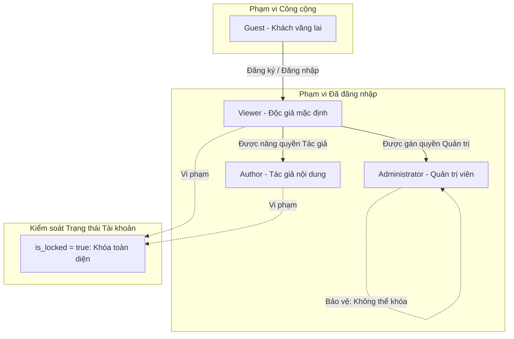
*Hình 2.2: Sơ đồ phân quyền các Actor trong hệ thống.*

---

## 2.2. Thiết kế Cơ sở dữ liệu (ERD)

Cơ sở dữ liệu của BlogMNM được thiết kế theo mô hình quan hệ chuẩn hóa (3NF), triển khai trên hệ quản trị MySQL 8.4 sử dụng Storage Engine **InnoDB**. Mô hình tập trung vào **9 bảng dữ liệu nghiệp vụ cốt lõi**, loại bỏ các bảng hạ tầng framework (như `sessions`, `cache`, `jobs`) khỏi sơ đồ thực thể nghiệp vụ:

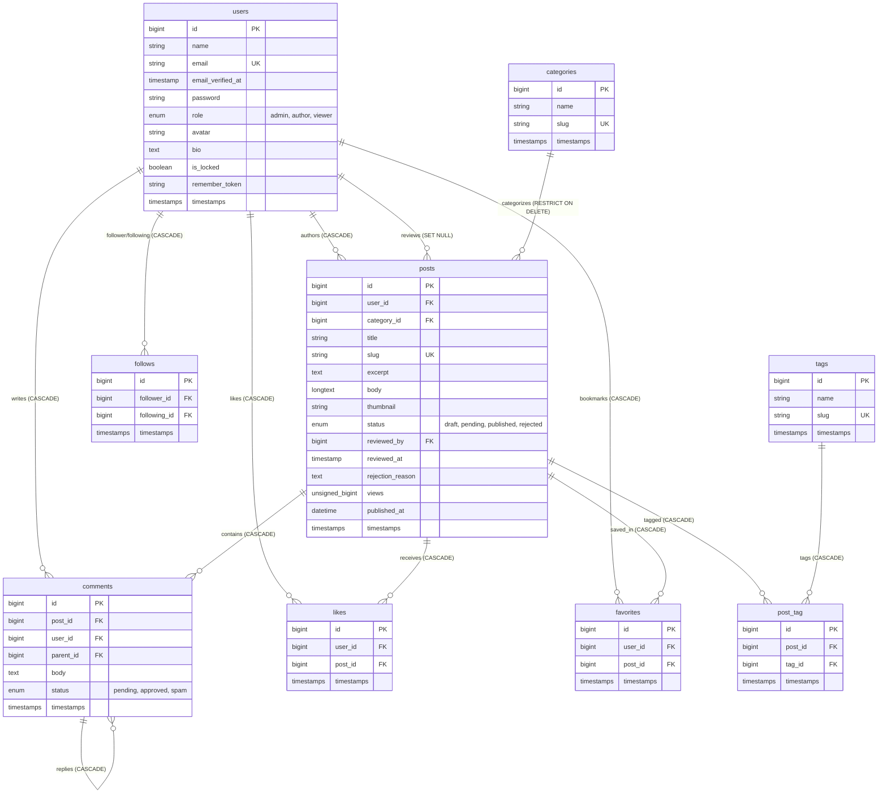
*Hình 2.3: Sơ đồ quan hệ thực thể (ERD) 9 bảng nghiệp vụ BlogMNM.*

### Giải thích các mối quan hệ và ràng buộc toàn vẹn
1. **Quan hệ Tác quyền (`users` → `posts`)**: Quan hệ Một - Nhiều (1 - N). Khi tài khoản người dùng bị xóa, toàn bộ bài viết do họ sáng tác sẽ bị xóa theo cơ chế `ON DELETE CASCADE`.
2. **Quan hệ Điều duyệt (`users` → `posts.reviewed_by`)**: Quan hệ Một - Nhiều (1 - N) biểu diễn người duyệt bài. Khi tài khoản người duyệt bị xóa, trường `reviewed_by` được cập nhật thành `NULL` (`ON DELETE SET NULL`), bảo vệ an toàn cho bài viết đã xuất bản.
3. **Quan hệ Bảo vệ Danh mục (`categories` → `posts`)**: Quan hệ Một - Nhiều (1 - N). Được thiết lập ràng buộc **`ON DELETE RESTRICT`** tại migration `2024_01_01_000010_update_posts_category_foreign_key_to_restrict.php`. Nếu một danh mục đang chứa dù chỉ một bài viết, cơ sở dữ liệu sẽ tuyệt đối ngăn chặn hành động xóa danh mục đó, loại bỏ triệt để nguy cơ mồ côi dữ liệu bài viết.
4. **Quan hệ Gắn thẻ bài viết (`posts` ↔ `tags`)**: Quan hệ Nhiều - Nhiều (N - N) thông qua bảng trung gian `post_tag`. Ràng buộc chỉ mục duy nhất `(post_id, tag_id)` ngăn chặn việc gắn trùng một thẻ tag cho cùng một bài viết.
5. **Quan hệ Bình luận lồng nhau (`comments` → `comments`)**: Khóa ngoại tự tham chiếu `parent_id` trỏ về `comments.id` với `ON DELETE CASCADE`. Khi bình luận cha bị xóa, toàn bộ các câu trả lời phản hồi con sẽ tự động được thu hồi.
6. **Quan hệ Tương tác xã hội (`likes`, `favorites`, `follows`)**: Đều được trang bị khóa chỉ mục phức hợp duy nhất (`UNIQUE KEY`): `(user_id, post_id)` đối với Like và Favorite; `(follower_id, following_id)` đối với Follow. Ràng buộc này đảm bảo một người dùng không thể thích hoặc theo dõi hai lần cùng một đối tượng ở tầng cơ sở dữ liệu.

---

## 2.3. Mô tả chi tiết các bảng dữ liệu

### Bảng 2.1: Bảng `users` (Quản lý tài khoản người dùng)
| Tên cột | Kiểu dữ liệu | Khóa | Cho phép NULL | Giá trị mặc định | Mô tả ý nghĩa |
| :--- | :--- | :---: | :---: | :---: | :--- |
| `id` | BIGINT UNSIGNED | PK | Không | AUTO_INCREMENT | Mã định danh duy nhất của người dùng |
| `name` | VARCHAR(255) | | Không | | Tên hiển thị của người dùng |
| `email` | VARCHAR(255) | UK | Không | | Địa chỉ thư điện tử dùng để đăng nhập (duy nhất) |
| `email_verified_at`| TIMESTAMP | | Có | NULL | Thời điểm xác thực email |
| `password` | VARCHAR(255) | | Không | | Chuỗi mật khẩu đã được mã hóa Bcrypt |
| `role` | ENUM('admin','author','viewer') | | Không | 'viewer' | Quyền hạn trong hệ thống |
| `avatar` | VARCHAR(255) | | Có | NULL | Đường dẫn tệp ảnh đại diện của người dùng |
| `bio` | TEXT | | Có | NULL | Tiểu sử / thông tin giới thiệu ngắn |
| `is_locked` | BOOLEAN | | Không | false | Cờ đánh dấu trạng thái tài khoản bị khóa |
| `remember_token` | VARCHAR(100) | | Có | NULL | Mã thông báo duy trì phiên đăng nhập |
| `created_at` | TIMESTAMP | | Có | NULL | Thời điểm tạo bản ghi |
| `updated_at` | TIMESTAMP | | Có | NULL | Thời điểm cập nhật bản ghi gần nhất |

### Bảng 2.2: Bảng `categories` (Quản lý danh mục bài viết)
| Tên cột | Kiểu dữ liệu | Khóa | Cho phép NULL | Giá trị mặc định | Mô tả ý nghĩa |
| :--- | :--- | :---: | :---: | :---: | :--- |
| `id` | BIGINT UNSIGNED | PK | Không | AUTO_INCREMENT | Mã định danh danh mục |
| `name` | VARCHAR(255) | | Không | | Tên gọi hiển thị của danh mục |
| `slug` | VARCHAR(255) | UK | Không | | Chuỗi định danh URL thân thiện (duy nhất) |
| `created_at` | TIMESTAMP | | Có | NULL | Thời điểm khởi tạo danh mục |
| `updated_at` | TIMESTAMP | | Có | NULL | Thời điểm cập nhật danh mục |

### Bảng 2.3: Bảng `tags` (Quản lý thẻ từ khóa)
| Tên cột | Kiểu dữ liệu | Khóa | Cho phép NULL | Giá trị mặc định | Mô tả ý nghĩa |
| :--- | :--- | :---: | :---: | :---: | :--- |
| `id` | BIGINT UNSIGNED | PK | Không | AUTO_INCREMENT | Mã định danh thẻ tag |
| `name` | VARCHAR(255) | | Không | | Tên hiển thị của thẻ tag |
| `slug` | VARCHAR(255) | UK | Không | | Chuỗi định danh URL của tag (duy nhất) |
| `created_at` | TIMESTAMP | | Có | NULL | Thời điểm tạo thẻ tag |
| `updated_at` | TIMESTAMP | | Có | NULL | Thời điểm cập nhật thẻ tag |

### Bảng 2.4: Bảng `posts` (Quản lý bài viết)
| Tên cột | Kiểu dữ liệu | Khóa | Cho phép NULL | Giá trị mặc định | Mô tả ý nghĩa |
| :--- | :--- | :---: | :---: | :---: | :--- |
| `id` | BIGINT UNSIGNED | PK | Không | AUTO_INCREMENT | Mã định danh duy nhất của bài viết |
| `user_id` | BIGINT UNSIGNED | FK | Không | | Mã tác giả viết bài (trỏ về `users.id`) |
| `category_id` | BIGINT UNSIGNED | FK | Không | | Mã danh mục (trỏ về `categories.id`, RESTRICT) |
| `title` | VARCHAR(255) | | Không | | Tiêu đề bài viết |
| `slug` | VARCHAR(255) | UK | Không | | Đường dẫn tĩnh thân thiện SEO (duy nhất) |
| `excerpt` | TEXT | | Có | NULL | Đoạn tóm tắt ngắn hiển thị trên feed |
| `body` | LONGTEXT | | Không | | Nội dung chi tiết bài viết (Markdown/HTML) |
| `thumbnail` | VARCHAR(255) | | Có | NULL | Đường dẫn tệp ảnh đại diện lưu trên disk |
| `status` | ENUM('draft','pending','published','rejected') | INDEX | Không | 'draft' | Trạng thái vòng đời bài viết |
| `reviewed_by` | BIGINT UNSIGNED | FK | Có | NULL | Mã Quản trị viên duyệt bài (trỏ `users.id`) |
| `reviewed_at` | TIMESTAMP | | Có | NULL | Thời điểm Quản trị viên duyệt/từ chối bài |
| `rejection_reason` | TEXT | | Có | NULL | Ghi chú phản hồi lý do từ chối bài viết |
| `views` | BIGINT UNSIGNED | INDEX | Không | 0 | Bộ đếm lượt xem bài viết |
| `published_at` | TIMESTAMP | INDEX | Có | NULL | Thời điểm công bố xuất bản bài viết |
| `created_at` | TIMESTAMP | | Có | NULL | Thời điểm tạo bản ghi bài viết |
| `updated_at` | TIMESTAMP | | Có | NULL | Thời điểm chỉnh sửa bài viết gần nhất |

### Bảng 2.5: Bảng `post_tag` (Bảng trung gian liên kết bài viết và thẻ)
| Tên cột | Kiểu dữ liệu | Khóa | Cho phép NULL | Giá trị mặc định | Mô tả ý nghĩa |
| :--- | :--- | :---: | :---: | :---: | :--- |
| `id` | BIGINT UNSIGNED | PK | Không | AUTO_INCREMENT | Mã định danh bản ghi liên kết |
| `post_id` | BIGINT UNSIGNED | FK | Không | | Mã bài viết (trỏ về `posts.id`) |
| `tag_id` | BIGINT UNSIGNED | FK | Không | | Mã thẻ tag (trỏ về `tags.id`) |
| `created_at` | TIMESTAMP | | Có | NULL | Thời điểm gán thẻ |
| `updated_at` | TIMESTAMP | | Có | NULL | Thời điểm cập nhật gán thẻ |

*Ràng buộc đặc biệt: `UNIQUE KEY unique_post_tag (post_id, tag_id)`.*

### Bảng 2.6: Bảng `comments` (Quản lý thảo luận và bình luận phân cấp)
| Tên cột | Kiểu dữ liệu | Khóa | Cho phép NULL | Giá trị mặc định | Mô tả ý nghĩa |
| :--- | :--- | :---: | :---: | :---: | :--- |
| `id` | BIGINT UNSIGNED | PK | Không | AUTO_INCREMENT | Mã định danh bình luận |
| `post_id` | BIGINT UNSIGNED | FK | Không | | Mã bài viết được bình luận (`posts.id`) |
| `user_id` | BIGINT UNSIGNED | FK | Không | | Mã người gửi bình luận (`users.id`) |
| `parent_id` | BIGINT UNSIGNED | FK | Có | NULL | Mã bình luận cha (NULL nếu là bình luận gốc) |
| `body` | TEXT | | Không | | Nội dung văn bản bình luận |
| `status` | ENUM('pending','approved','spam') | INDEX | Không | 'pending' | Trạng thái kiểm duyệt bình luận |
| `created_at` | TIMESTAMP | | Có | NULL | Thời điểm gửi bình luận |
| `updated_at` | TIMESTAMP | | Có | NULL | Thời điểm chỉnh sửa bình luận |

### Bảng 2.7: Bảng `favorites` (Quản lý bài viết yêu thích / Bookmark)
| Tên cột | Kiểu dữ liệu | Khóa | Cho phép NULL | Giá trị mặc định | Mô tả ý nghĩa |
| :--- | :--- | :---: | :---: | :---: | :--- |
| `id` | BIGINT UNSIGNED | PK | Không | AUTO_INCREMENT | Mã định danh bản ghi lưu yêu thích |
| `user_id` | BIGINT UNSIGNED | FK | Không | | Mã người dùng lưu bài (`users.id`) |
| `post_id` | BIGINT UNSIGNED | FK | Không | | Mã bài viết được lưu (`posts.id`) |
| `created_at` | TIMESTAMP | | Có | NULL | Thời điểm đánh dấu yêu thích |
| `updated_at` | TIMESTAMP | | Có | NULL | Thời điểm cập nhật |

*Ràng buộc đặc biệt: `UNIQUE KEY unique_user_post_favorite (user_id, post_id)`.*

### Bảng 2.8: Bảng `likes` (Quản lý tương tác thả tim bài viết)
| Tên cột | Kiểu dữ liệu | Khóa | Cho phép NULL | Giá trị mặc định | Mô tả ý nghĩa |
| :--- | :--- | :---: | :---: | :---: | :--- |
| `id` | BIGINT UNSIGNED | PK | Không | AUTO_INCREMENT | Mã định danh bản ghi thả tim |
| `user_id` | BIGINT UNSIGNED | FK | Không | | Mã người dùng thả tim (`users.id`) |
| `post_id` | BIGINT UNSIGNED | FK | Không | | Mã bài viết được thả tim (`posts.id`) |
| `created_at` | TIMESTAMP | | Có | NULL | Thời điểm thả tim |
| `updated_at` | TIMESTAMP | | Có | NULL | Thời điểm cập nhật |

*Ràng buộc đặc biệt: `UNIQUE KEY unique_user_post_like (user_id, post_id)`.*

### Bảng 2.9: Bảng `follows` (Quản lý mạng lưới theo dõi tác giả)
| Tên cột | Kiểu dữ liệu | Khóa | Cho phép NULL | Giá trị mặc định | Mô tả ý nghĩa |
| :--- | :--- | :---: | :---: | :---: | :--- |
| `id` | BIGINT UNSIGNED | PK | Không | AUTO_INCREMENT | Mã định danh quan hệ theo dõi |
| `follower_id`| BIGINT UNSIGNED | FK | Không | | Mã người nhấn theo dõi (`users.id`) |
| `following_id`| BIGINT UNSIGNED | FK | Không | | Mã tác giả được theo dõi (`users.id`) |
| `created_at` | TIMESTAMP | | Có | NULL | Thời điểm bắt đầu theo dõi |
| `updated_at` | TIMESTAMP | | Có | NULL | Thời điểm cập nhật quan hệ |

*Ràng buộc đặc biệt: `UNIQUE KEY unique_user_follow (follower_id, following_id)`.*

---

# CHƯƠNG 3: CÔNG NGHỆ ÁP DỤNG VÀ MÔ TẢ CHỨC NĂNG

## 3.1. Công nghệ và Công cụ sử dụng

Qua đối soát trực tiếp mã nguồn `composer.json`, `package.json` và môi trường thực thi máy chủ, hệ thống BlogMNM sử dụng chính xác các công nghệ sau:

### Danh mục công nghệ và công cụ thực tế
- **Ngôn ngữ lập trình máy chủ**: **PHP 8.3.30** (Sử dụng nghiêm ngặt strict types, constructor property promotion, match expressions và typed properties).
- **Web Framework chính**: **Laravel Framework 13.33.0** (Cung cấp Routing, Eloquent ORM, Middleware pipeline, Service Container, Blade view engine, Validation, Session và Authentication).
- **Bộ công cụ xác thực**: **Laravel Breeze v2.4** (Cấu hình stack Blade mượt mà, xác thực session stateful).
- **Hệ quản trị cơ sở dữ liệu**: **MySQL 8.4.3 Community Server** (Sử dụng InnoDB Engine, hỗ trợ transactions và kiểm soát khóa ngoại).
- **Styling & CSS Framework**: **Tailwind CSS v3.4.19** kết hợp `@tailwindcss/forms ^0.5.2` và hệ thống biến toàn cục CSS Design Tokens (Lưu ý: Tệp `package.json` có khai báo `@tailwindcss/vite ^4.0.0` do tàn dư cấu hình ban đầu, tuy nhiên pipeline đóng gói và biên dịch thực tế của dự án hoạt động ổn định trên kiến trúc Tailwind v3 thông qua PostCSS/Vite).
- **Tương tác động máy khách**: **Alpine.js v3.17.4** và **Vanilla JavaScript** (sử dụng Native `fetch()` API cho các tương tác AJAX).
- **Công cụ biên dịch và đóng gói Assets**: **Vite v8.3.1** kết hợp plugin chính thức `laravel-vite-plugin v3.2.0`.
- **Môi trường phát triển cục bộ**: **Laragon v6.0** (tích hợp PHP 8.3, MySQL 8.4, Apache/Nginx).
- **Công cụ kiểm thử tự động**: **PHPUnit v12.5.35** thực thi qua `php artisan test`.
- **Công cụ chuẩn hóa mã nguồn**: **Laravel Pint v1.32.1** (tuân thủ nghiêm ngặt chuẩn quốc tế PSR-12).

### Kiến trúc phân tầng hệ thống (3-Tier Layered Architecture)
Hệ thống được tổ chức mạch lạc theo mô hình phân tầng hướng dịch vụ:

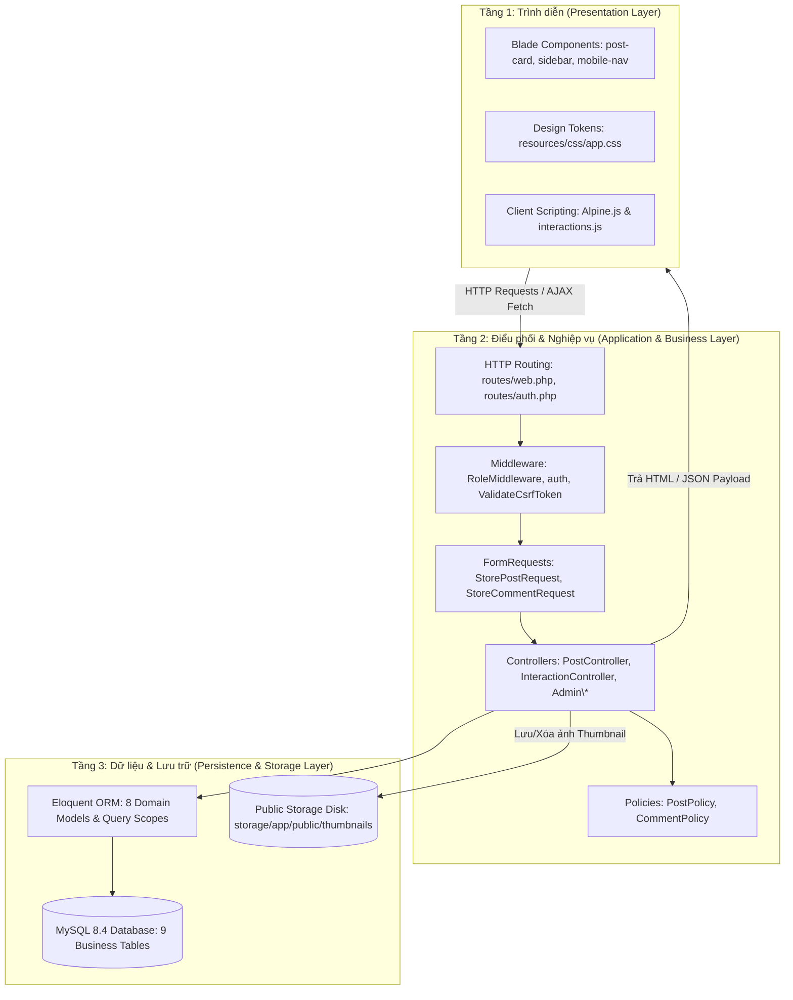
*Hình 3.1: Sơ đồ kiến trúc phân tầng 3-Tier của hệ thống BlogMNM.*

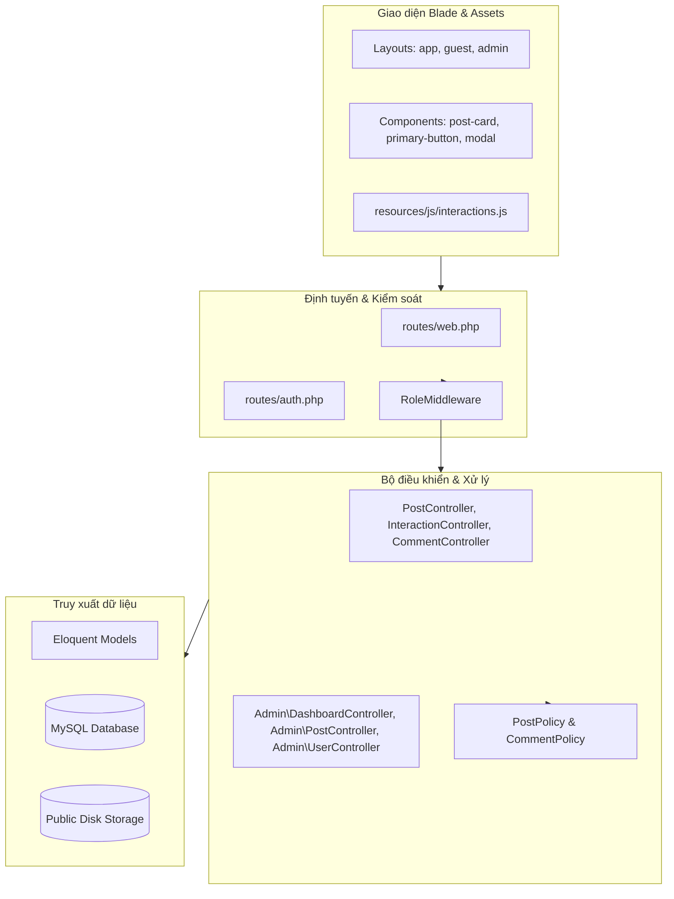
*Hình 3.2: Sơ đồ thành phần phần mềm (UML Component Diagram).*

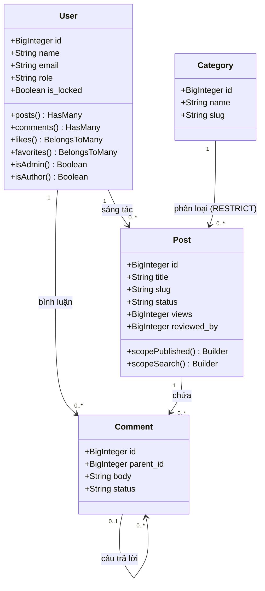
*Hình 3.3: Sơ đồ lớp miền nghiệp vụ (UML Domain Model Class Diagram).*

---

## 3.2. Mô tả các chức năng cốt lõi

### A. Đăng nhập, Đăng xuất và Phân quyền (Login, Logout & RBAC)
- **Mục đích**: Bảo vệ hệ thống thông qua xác thực định danh và phân định quyền lực minh bạch.
- **Tác nhân**: Toàn bộ người dùng.
- **Phương thức vận hành**:
  - Đăng ký tài khoản (`POST /register`): Dữ liệu được lọc qua whitelist `$fillable` trên `User.php`. Trường `role` luôn nhận mặc định `'viewer'`. Mọi hành vi tiêm tham số `role=admin` đều bị loại bỏ tự động (`AUTH-03`).
  - Đăng nhập (`POST /login`): Kiểm soát giới hạn tần suất tối đa 5 lần thử thất bại cho mỗi cặp định danh email và địa chỉ IP (`throttleKey`) trong khoảng thời gian đếm ngược thông qua `LoginRequest::ensureIsNotRateLimited()`. Đăng nhập thành công thực hiện tái tạo ID phiên làm việc `$request->session()->regenerate()` chống tấn công Session Fixation.
  - Chặn tài khoản bị khóa (`AUTH-07`): Tại `LoginRequest`, nếu `Auth::user()?->is_locked === true`, hệ thống ngay lập tức kích hoạt `Auth::logout()`, vô hiệu hóa phiên làm việc (`$this->session()->invalidate()`), tái tạo CSRF token (`$this->session()->regenerateToken()`), ghi nhận lần thử vào bộ giới hạn tần suất (`RateLimiter::hit($this->throttleKey())`) và trả về lỗi HTTP 422: *"Tài khoản của bạn đã bị khóa. Vui lòng liên hệ quản trị viên."*
  - Phân quyền: `RoleMiddleware` kiểm tra `$request->user()->role` và cờ `$request->user()->is_locked`. Người dùng vi phạm quyền sẽ nhận mã lỗi HTTP 403 Forbidden.
- **Tham chiếu minh chứng**: [SCREENSHOT REQUIRED - Hình 4.1: Giao diện Đăng nhập hệ thống BlogMNM].

### B. Thao tác CRUD trên ít nhất hai bảng có quan hệ (Bài viết, Danh mục, Thẻ tag, Bình luận)
- **Mục đích**: Quản lý nội dung bài viết và phân loại đa chiều với tính toàn vẹn dữ liệu tuyệt đối.
- **Tác nhân**: Tác giả (Author), Quản trị viên (Admin).
- **Phương thức vận hành**:
  - **Create**: Tác giả gửi biểu mẫu `POST /posts` với tiêu đề, danh mục, nội dung, thẻ tag và ảnh thumbnail. `StorePostRequest` tự động loại bỏ tham số `status` do máy khách gửi lên (`SEC-02`), bắt buộc bài viết mới tạo có trạng thái `'draft'` và lượt xem bằng `0`.
  - **Read**: Dòng tin bài viết được nạp kèm các quan hệ `with(['user', 'category', 'tags'])` và đếm sẵn `withCount(['likers', 'favoritedBy', 'comments'])`, triệt tiêu hoàn toàn vấn đề N+1 Query.
  - **Update**: Tác giả chỉnh sửa bài viết tại `PUT /posts/{post}`. Nếu tải lên ảnh đại diện mới, ảnh cũ trên ổ đĩa sẽ tự động bị xóa bỏ (`POST-03`).
  - **Delete**: Khi xóa bài viết qua `DELETE /posts/{post}`, hook `Post::booted()` tự động kích hoạt xóa tệp tin ảnh thumbnail tương ứng trên disk `public`, ngăn chặn tình trạng tệp tin rác mồ côi (`POST-04`).
  - **Quan hệ ràng buộc Danh mục**: Khi xóa danh mục tại `DELETE /admin/categories/{category}`, nếu danh mục đang có bài viết, hệ thống chặn lại với thông báo lỗi: *"Cannot delete category because it has active posts assigned to it"* nhờ khóa ngoại `ON DELETE RESTRICT` (`SEC-06`).
- **Tham chiếu minh chứng**: [SCREENSHOT REQUIRED - Hình 3.7: Giao diện Soạn thảo bài viết của Tác giả], [SCREENSHOT REQUIRED - Hình 3.8: Bảng điều khiển thống kê của Tác giả].

### C. Tìm kiếm và Phân trang (Search & Pagination)
- **Mục đích**: Cho phép độc giả tra cứu nhanh bài viết đã xuất bản và duyệt danh sách có hiệu năng cao.
- **Tác nhân**: Khách vãng lai, Độc giả.
- **Phương thức vận hành**:
  - Tìm kiếm toàn văn: Truy vấn `GET /posts?q={keyword}` kích hoạt scope `Post::scopeSearch()`. Cụm điều kiện `LIKE '%keyword%'` trên 3 trường `title`, `excerpt`, `body` được bao đóng trong nhóm ngoặc đơn SQL độc lập, đảm bảo không làm lộ các bài viết bản nháp hoặc chờ duyệt (`SRCH-01`).
  - Kết hợp bộ lọc: Cho phép xếp chồng đồng thời từ khóa tìm kiếm và danh mục (`?q=laravel&category=technology`).
  - Phân trang chuẩn mực: Sử dụng `LengthAwarePaginator` với 10 bài/trang. Tích hợp `withQueryString()` giúp lưu giữ toàn bộ chuỗi tìm kiếm trên các nút chuyển trang.
  - Điều hướng an toàn biên: Nếu người dùng nhập chỉ số trang không hợp lệ như `?page=0` hoặc `?page=99999`, hệ thống tự động bắt lỗi và điều hướng về trang hợp lệ gần nhất (Trang 1 hoặc Trang cuối) mà không gây sập ứng dụng (`SRCH-04`).
- **Tham chiếu minh chứng**: [SCREENSHOT REQUIRED - Hình 3.6: Giao diện Tìm kiếm và Bộ lọc danh mục].

### D. Kiểm tra hợp lệ dữ liệu (Validation qua FormRequests)
- **Mục đích**: Bảo vệ tính toàn vẹn của dữ liệu đầu vào trước khi đến tầng xử lý nghiệp vụ.
- **Tác nhân**: Độc giả, Tác giả, Quản trị viên.
- **Phương thức vận hành**:
  - `StorePostRequest`: Bắt buộc tiêu đề tối đa 255 ký tự, `category_id` phải tồn tại trong bảng `categories`, bắt buộc có nội dung bài viết (`content` hoặc `body` thông qua quy tắc `required_without`, không áp đặt độ dài tối thiểu), tệp ảnh thumbnail phải có định dạng hợp lệ (`jpg,jpeg,png,webp`) và dung lượng không vượt quá 2048 KB (`SEC-03`, `SEC-04`).
  - `StoreCommentRequest`: Bắt buộc độ dài nội dung từ 2 đến 2000 ký tự. Đặc biệt, phương thức `withValidator()` kiểm tra tính hợp lệ của `parent_id`: bình luận cha bắt buộc phải thuộc cùng một bài viết (`INT-09`), ngăn chặn hành vi giả mạo câu trả lời xuyên bài viết.

### E. Quy trình Xuất bản và Điều duyệt bài viết (Editorial Moderation Workflow)
- **Mục đích**: Đảm bảo chất lượng bài viết thông qua kiểm duyệt độc lập của Quản trị viên trước khi công khai.
- **Tác nhân**: Tác giả, Quản trị viên.
- **Phương thức vận hành**:
  - Tác giả gửi duyệt (`POST /posts/{id}/submit`): `PostPolicy::submit()` xác minh quyền sở hữu và chỉ cho phép gửi duyệt khi bài viết ở trạng thái `'draft'` hoặc `'rejected'`. Trạng thái chuyển thành `'pending'`.
  - Quản trị viên điều hành (`/admin/dashboard`): Quản trị viên theo dõi tổng quan số liệu bài viết, bình luận và người dùng trên bảng điều khiển trung tâm.
  - Quản trị viên duyệt bài (`POST /admin/posts/{id}/approve`): Trạng thái chuyển thành `'published'`, tự động ghi nhận mã quản trị viên vào `reviewed_by`, thời gian duyệt `reviewed_at` và thời gian xuất bản `published_at` (`POST-07`).
  - Quản trị viên từ chối (`POST /admin/posts/{id}/reject`): Nhập lý do từ chối vào hộp thoại modal. Trạng thái chuyển thành `'rejected'`, lưu lại `rejection_reason` giúp tác giả biết rõ nguyên nhân để sửa đổi và gửi duyệt lại (`POST-08`, `POST-09`).
- **Tham chiếu minh chứng**: [SCREENSHOT REQUIRED - Hình 3.9: Bảng điều khiển trung tâm của Quản trị viên], [SCREENSHOT REQUIRED - Hình 3.10: Hàng đợi duyệt bài viết của Quản trị viên].

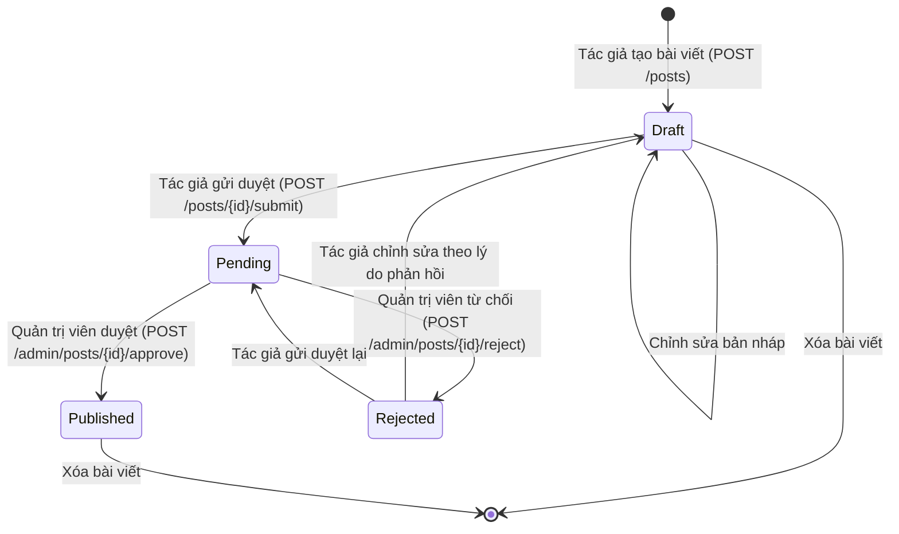
*Hình 3.11: Sơ đồ máy trạng thái vòng đời xuất bản bài viết.*

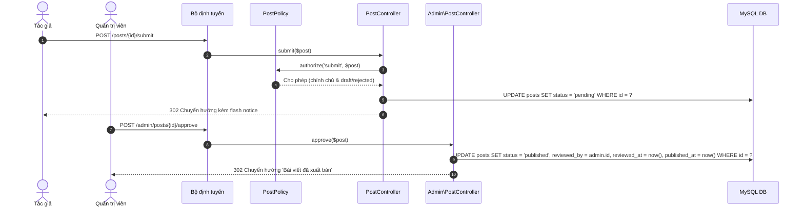
*Hình 3.12: Sơ đồ tuần tự quy trình điều duyệt bài viết của Quản trị viên.*

### F. Thảo luận phân cấp và Tương tác cộng đồng
- **Mục đích**: Xây dựng cộng đồng tương tác sôi nổi, văn minh.
- **Tác nhân**: Độc giả, Quản trị viên.
- **Phương thức vận hành**:
  - Thả tim (Like): Gửi yêu cầu AJAX `POST /posts/{id}/like`. Nếu người dùng chưa thực hiện Thả tim (Like) thì tạo bản ghi mới trong bảng `likes`, nếu đã thực hiện trước đó thì xóa bản ghi (bỏ thích). Trả về phản hồi định dạng JSON chuẩn `{"liked": boolean, "likes_count": number}` (`INT-01`, `INT-02`).
  - Thư viện yêu thích (Favorites): Gửi yêu cầu `POST /posts/{id}/favorite` lưu vào bảng `favorites`. Độc giả có thể xem lại toàn bộ tại `/favorites` (`INT-03`, `INT-04`).
  - Theo dõi Tác giả (Follow): Gửi yêu cầu `POST /authors/{id}/follow`. Nếu cố tình tự theo dõi chính mình, hệ thống trả về mã lỗi HTTP 422: `{"message": "Cannot follow self."}` (`INT-05`, `INT-06`).
  - Bình luận phân cấp: Cho phép bình luận gốc và trả lời lồng nhau 2 cấp. Khi hiển thị công khai tại `PostController@show`, hệ thống chỉ tải các bình luận có `status = 'approved'`, ẩn triệt để các bình luận đang chờ duyệt hoặc spam đối với người dùng phổ thông (`INT-10`).
- **Tham chiếu minh chứng**: [SCREENSHOT REQUIRED - Hình 3.4: Giao diện Trang chủ và Dòng tin chính], [SCREENSHOT REQUIRED - Hình 3.5: Giao diện Chi tiết bài viết và Thảo luận phân cấp].

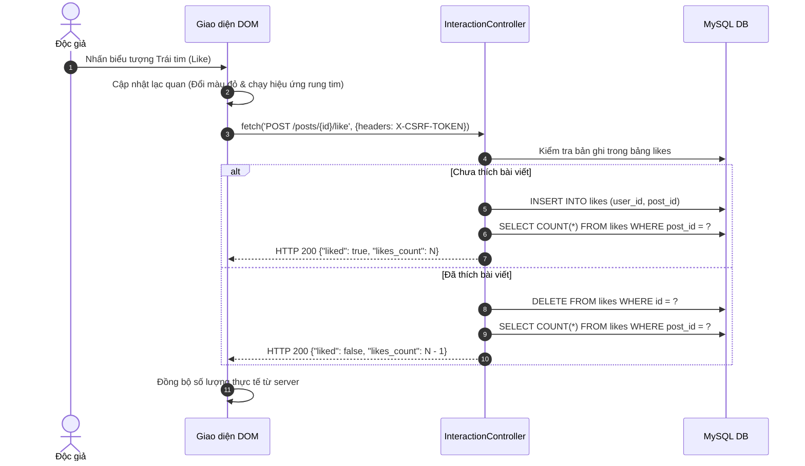
*Hình 3.13: Sơ đồ tuần tự tương tác Thả tim (Like) bất đồng bộ qua AJAX.*

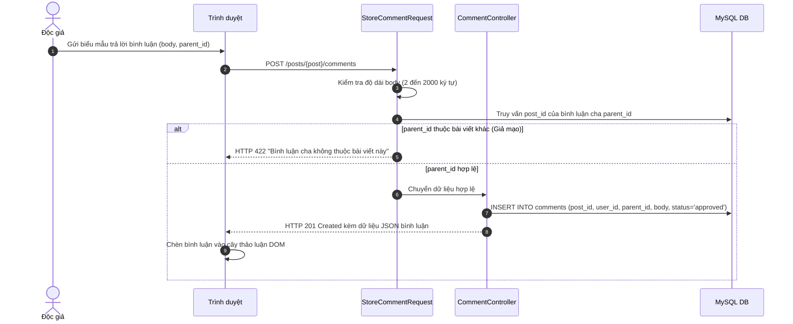
*Hình 3.14: Sơ đồ tuần tự gửi bình luận phân cấp và xác thực chống giả mạo liên bài viết.*

---

## 3.3. Chức năng nâng cao & Sáng tạo

Dự án BlogMNM không chỉ dừng lại ở các chức năng CRUD cơ bản mà còn mở rộng nhiều giải pháp sáng tạo mang tính đột phá về cả mặt trải nghiệm người dùng lẫn kỹ thuật kiến trúc bảo mật:

### 1. Hệ thống giao diện Monochrome lấy cảm hứng từ Threads & Chuyển đổi theme không giật hình
- **Sự khác biệt**: Thay vì sử dụng các màu sắc rực rỡ truyền thống gây mỏi mắt, BlogMNM áp dụng ngôn ngữ thiết kế Monochrome (Trắng/Đen tuyệt đối: Nền tối `#000000` / Nền sáng `#ffffff`).
- **Cơ chế Design Tokens**: Toàn bộ hệ thống màu sắc được định nghĩa qua biến CSS tùy biến (`--color-bg`, `--color-surface`, `--color-border`, `--color-text`) trong `resources/css/app.css`.
- **Nút đảo màu thông minh (Inverted Button Pattern)**: Sử dụng lớp `bg-[var(--color-text)] text-[var(--color-bg)]`, các nút bấm hành động chính tự động đảo màu trắng trên nền đen ở Dark Mode và đen trên nền trắng ở Light Mode mà không cần bất kỳ câu lệnh điều kiện Blade nào.
- **Động cơ nạp Theme không giật hình (Zero-Flash Engine)**: Một đoạn script đồng bộ siêu nhẹ được đặt trực tiếp trong thẻ `<head>` của `resources/views/layouts/app.blade.php`. Script đọc cài đặt lưu trong `localStorage`; nếu chưa có giá trị, mặc định kích hoạt chủ đề Tối (`'dark'`) trước khi DOM được vẽ, loại bỏ 100% hiện tượng chớp nháy trắng màn hình (FOUC).
- **Tham chiếu minh chứng**: [SCREENSHOT REQUIRED - Hình 3.15: So sánh Dark Mode và Light Mode], [SCREENSHOT REQUIRED - Hình 3.16: Giao diện Responsive trên Tablet và Mobile].

### 2. Kiến trúc Bảo mật Đa lớp & Chống leo thang quyền (Defense-in-Depth)

Hệ thống triển khai 5 chốt chặn an ninh nghiêm ngặt đã được kiểm chứng qua bộ kiểm thử tự động `tests/Feature/QASuiteTest.php` nhằm bảo vệ toàn vẹn dữ liệu (tham chiếu chi tiết cơ chế tại Mục 3.2):

1. **Chặn tài khoản bị khóa ở 5 tầng (`AUTH-07`, `ROLE-11`)**: Khi người dùng bị khóa (`is_locked = true`), hệ thống ngăn chặn truy cập xuyên suốt từ: Request đăng nhập → Middleware phân quyền → Policy xuất bản → FormRequest gửi dữ liệu → Controller xử lý tương tác.
2. **Bảo vệ kép chống khóa Quản trị viên đồng cấp (`SEC-05`)**: Tại `Admin\UserController@lock`, hệ thống triển khai hai khối phòng vệ độc lập:
   ```php
   // Chốt 1: Chống tự khóa tài khoản bản thân
   if ($user->id === $request->user()->id) {
       return redirect()->back()
           ->with('error', 'Hành động bị chặn: Bạn không thể tự khóa tài khoản của chính mình.');
   }

   // Chốt 2: Chống khóa Quản trị viên đồng cấp
   if ($user->isAdmin()) {
       return redirect()->back()
           ->with('error', 'Hành động bị chặn: Bạn không thể khóa tài khoản của Quản trị viên khác.');
   }
   ```
3. **Chống giả mạo bình luận xuyên bài viết (`INT-09`)**: Bắt lỗi tại `StoreCommentRequest`, ngăn chặn triệt để hành vi cố ý truyền `parent_id` của bài viết khác (tham chiếu Mục 3.2.D).
4. **Bảo vệ toàn vẹn danh mục (`SEC-06`)**: Khóa ngoại `ON DELETE RESTRICT` tại migration `2024_01_01_000010_update_posts_category_foreign_key_to_restrict.php` phối hợp cùng kiểm tra `$category->posts()->exists()` tại controller, ngăn chặn xóa các danh mục đang có bài viết hoạt động (tham chiếu Mục 3.2.B).
5. **Dọn dẹp tệp tin mồ côi tự động (`POST-04`)**: Hook `Post::booted()` tự động quét và xóa tệp tin ảnh thumbnail trên ổ đĩa `storage/app/public/thumbnails/` khi bài viết bị xóa hoặc khi tác giả tải ảnh mới thay thế (tham chiếu Mục 3.2.B).

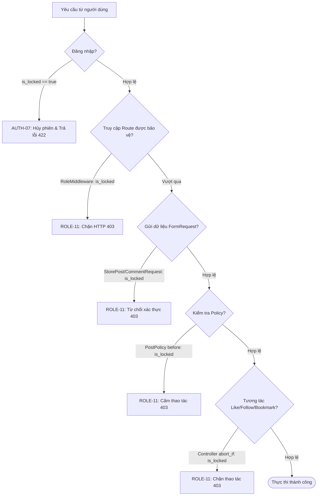
*Hình 3.18: Sơ đồ hoạt động luồng khóa tài khoản và kiểm soát bảo mật đa tầng.*

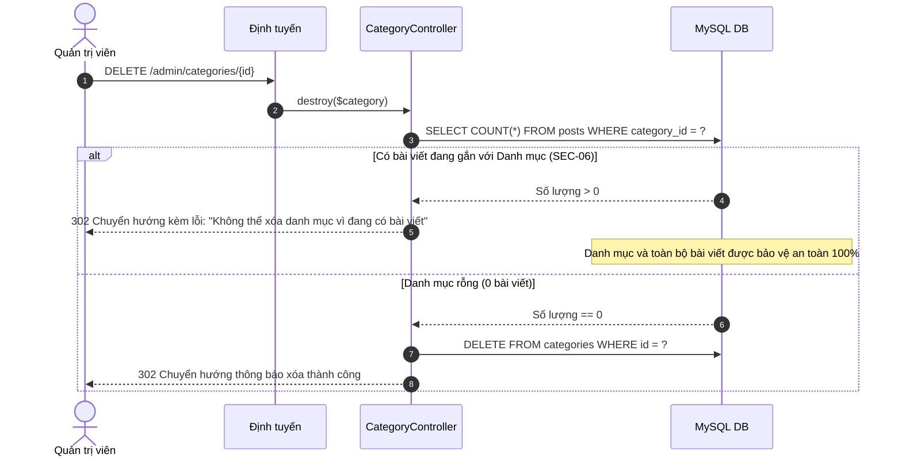
*Hình 3.19: Sơ đồ tuần tự cơ chế bảo vệ xóa danh mục bài viết (`ON DELETE RESTRICT`).*

- **Tham chiếu minh chứng**: [SCREENSHOT REQUIRED - Hình 3.17: Minh chứng xử lý tài khoản khóa và Admin safeguard].

---

# CHƯƠNG 4: HƯỚNG DẪN CÀI ĐẶT VÀ VẬN HÀNH

Chương này cung cấp tài liệu hướng dẫn kỹ thuật chi tiết về chuẩn bị môi trường, quy trình cài đặt từng bước, danh mục tài khoản thử nghiệm mẫu và quy trình vận hành hệ thống BlogMNM dành cho người đọc, tác giả và quản trị viên.

## 4.1. Yêu cầu môi trường hệ thống
Để triển khai và vận hành hệ thống BlogMNM một cách trơn tru, môi trường máy chủ cục bộ cần đáp ứng các tiêu chuẩn tối thiểu sau:
- **Hệ điều hành**: Windows 10/11, macOS hoặc Linux (Ubuntu 22.04+).
- **PHP**: Phiên bản `^8.3` (Kích hoạt các extensions: `pdo_mysql`, `mbstring`, `openssl`, `tokenizer`, `xml`, `ctype`, `json`, `bcmath`, `fileinfo`).
- **Composer**: Phiên bản `^2.5`.
- **Node.js & npm**: Node.js LTS `^18.x` hoặc `^20.x` và npm `^9.x`.
- **Hệ quản trị cơ sở dữ liệu**: MySQL `^8.4` (hoặc MariaDB `^10.11`).
- **Công cụ web server đề xuất**: Laragon (trên Windows) hoặc Laravel Herd / Docker.

---

## 4.2. Quy trình cài đặt từng bước

Dự án được thiết lập thông qua 11 bước tiêu chuẩn đã được xác thực thực tế:

### Bước 1: Tải mã nguồn dự án (Clone Repository)
```bash
git clone https://github.com/minhkhoi7070/dan-webblog.git
cd webblog
```

### Bước 2: Thiết lập tệp cấu hình môi trường (.env)
Sao chép cấu hình từ tệp mẫu `.env.example`:
```bash
cp .env.example .env
```
Mở tệp `.env` và thiết lập các tham số kết nối cơ sở dữ liệu MySQL phù hợp với máy cục bộ:
```ini
APP_NAME="BlogMNM"
APP_ENV=local
APP_KEY=
APP_DEBUG=true
APP_URL=http://127.0.0.1:8000

DB_CONNECTION=mysql
DB_HOST=127.0.0.1
DB_PORT=3306
DB_DATABASE=webblog
DB_USERNAME=root
DB_PASSWORD=
```

### Bước 3: Cài đặt các gói phụ thuộc PHP (Composer Install)
```bash
composer install
```

### Bước 4: Khởi tạo khóa mã hóa ứng dụng (Key Generation)
```bash
php artisan key:generate
```

### Bước 5: Thực thi di chuyển cơ sở dữ liệu và nạp dữ liệu mẫu (Migration & Seeding)
Lệnh này sẽ khởi tạo toàn bộ 9 bảng nghiệp vụ, thiết lập các chỉ số, tạo khóa ngoại `RESTRICT` và nạp tài khoản mẫu:
```bash
php artisan migrate:fresh --seed
```

### Bước 6: Tạo liên kết Symbolic Link cho tệp lưu trữ (Storage Link)
Cho phép trình duyệt truy cập công khai vào các ảnh thumbnail bài viết được lưu trữ trong `storage/app/public`:
```bash
php artisan storage:link
```

### Bước 7: Cài đặt các thư viện Frontend (NPM Install)
```bash
npm install
```

### Bước 8: Biên dịch tài nguyên giao diện (Frontend Build)
Biên dịch các tệp CSS tokens và JavaScript tối ưu hóa cho môi trường chạy thực tế:
```bash
npm run build
```

### Bước 9: Khởi chạy máy chủ phát triển nội bộ (Server Start)
```bash
php artisan serve --port=8000
```
Sau khi khởi chạy thành công, truy cập ứng dụng tại địa chỉ: **`http://127.0.0.1:8000`**

- **Tham chiếu minh chứng**: [SCREENSHOT REQUIRED - Hình 4.2: Minh chứng thực thi lệnh cài đặt và khởi chạy hệ thống trên terminal].

---

## 4.3. Danh sách tài khoản thử nghiệm mẫu

Hệ thống Seeder (`Database\Seeders\DatabaseSeeder.php`) đã tạo sẵn các tài khoản thử nghiệm phục vụ kiểm thử và chấm điểm:

| Nhóm quyền (Role) | Địa chỉ Email đăng nhập | Mật khẩu truy cập | Ghi chú vai trò |
| :--- | :--- | :--- | :--- |
| **Quản trị viên (Administrator)** | `admin@blogmnm.test` | `password` | Toàn quyền quản trị, duyệt bài viết, kiểm duyệt bình luận, quản lý tài khoản tại `/admin`. |
| **Tác giả (Author)** | Tài khoản tạo tự động từ seeder (hoặc tạo mới gán role author) | `password` | Soạn thảo bài viết, tải ảnh thumbnail, gửi bài duyệt và theo dõi thống kê `/author/posts/stats`. |
| **Độc giả (Viewer)** | Tài khoản tạo tự động từ seeder (hoặc đăng ký mới) | `password` | Đọc bài viết, thả tim (Like), lưu bài (Bookmark), theo dõi tác giả và gửi bình luận. |

---

## 4.4. Hướng dẫn vận hành người dùng và tác giả

1. **Khám phá và đọc bài viết**:
   - Truy cập trang chủ `/`, duyệt qua các bài viết trên dòng tin trung tâm 660px.
   - Nhấn vào biểu tượng chuyển đổi chủ đề tại thanh điều hướng để đổi giữa Dark Mode và Light Mode.
   - Sử dụng thanh tìm kiếm phía trên để tìm từ khóa hoặc nhấp vào các chip danh mục (*Technology*, *Lifestyle*...) để lọc nội dung.
   - Nhấp vào tiêu đề bài viết để đọc chi tiết và hệ thống sẽ tự động tăng số lượt xem lên 1 đơn vị.
2. **Tương tác cộng đồng**:
   - Đăng nhập tài khoản Viewer/Author.
   - Nhấn vào biểu tượng Trái tim để Thả tim (số lượng nhảy tức thì qua AJAX).
   - Nhấn vào biểu tượng Bookmark để lưu vào mục Yêu thích (truy cập `/favorites` để quản lý).
   - Truy cập trang tác giả (`/authors/{id}`) và nhấn "Follow" để theo dõi.
   - Cuộn xuống chân bài viết để nhập bình luận gốc hoặc nhấn "Reply" để gửi câu trả lời phân cấp.
3. **Soạn thảo và xuất bản bài viết dành cho Tác giả**:
   - Nhấn vào liên kết **New Post** trên thanh điều hướng (`/posts/create`).
   - Nhập tiêu đề, chọn danh mục, gắn thẻ tags, nhập tóm tắt và nội dung chi tiết.
   - Kéo thả tệp ảnh thumbnail (định dạng jpg, png, webp, dung lượng ≤ 2MB).
   - Nhấn **Save Draft** để lưu bản nháp an toàn. Bài viết bản nháp hoàn toàn vô hình với công chúng.
   - Khi hoàn thiện, nhấn **Submit for Review** để đưa bài viết vào hàng đợi duyệt của Quản trị viên (`status = 'pending'`).
   - Truy cập **Author Stats** (`/author/posts/stats`) để xem biểu đồ thống kê tổng lượt xem, lượt like, bình luận và danh sách các bài viết cá nhân.

---

## 4.5. Hướng dẫn vận hành quản trị viên

1. **Truy cập Cổng Quản trị**:
   - Đăng nhập với tài khoản `admin@blogmnm.test` / `password`.
   - Nhấn vào mục **Admin** trên thanh menu hoặc truy cập đường dẫn `/admin`.
2. **Điều hành xuất bản bài viết**:
   - Truy cập mục **Posts** (`/admin/posts`).
   - Xem danh sách các bài viết đang ở trạng thái `Pending Review`.
   - Nhấp vào tiêu đề để đọc nội dung và kiểm tra ảnh đại diện.
   - Nhấn nút **Approve** màu nổi bật để xuất bản ngay lập tức ra trang chủ.
   - Hoặc nhấn nút **Reject**, nhập lý do từ chối phản hồi cho tác giả và xác nhận.
3. **Điều duyệt bình luận**:
   - Truy cập mục **Comments** (`/admin/comments`).
   - Nhấn **Approve** để phê duyệt bình luận hiển thị công khai.
   - Nhấn **Mark Spam** để gắn cờ spam và ẩn khỏi tầm nhìn của người đọc.
   - Nhấn **Delete** để xóa vĩnh viễn bình luận vi phạm.
4. **Quản trị người dùng**:
   - Truy cập mục **Users** (`/admin/users`).
   - Tìm kiếm người dùng, nhấp **Lock Account** để khóa tài khoản vi phạm.
   - Hệ thống tự động chặn hành vi khóa tài khoản Quản trị viên khác (`SEC-05`).
5. **Quản lý danh mục**:
   - Truy cập **Categories** (`/admin/categories`).
   - Nhấn **New Category** để thêm danh mục mới.
   - Khi xóa danh mục có chứa bài viết, hệ thống hiển thị cảnh báo từ chối an toàn (`SEC-06`).

---

## 4.6. Xử lý các sự cố thường gặp (Troubleshooting)

1. **Lỗi `ViteException: Unable to locate file in Vite manifest`**:
   - *Nguyên nhân*: Chưa biên dịch các tệp tài nguyên frontend.
   - *Khắc phục*: Chạy lệnh `npm run build` hoặc giữ tiến trình `npm run dev`.
2. **Lỗi ảnh thumbnail không hiển thị (Mã lỗi HTTP 404)**:
   - *Nguyên nhân*: Chưa tạo liên kết symbolic link từ `storage/app/public` ra `public/storage`.
   - *Khắc phục*: Chạy lệnh `php artisan storage:link`.
3. **Lỗi kết nối cơ sở dữ liệu (Database Connection Refused)**:
   - *Nguyên nhân*: Dịch vụ MySQL chưa được khởi động trong Laragon/XAMPP hoặc cấu hình sai cổng tại `.env`.
   - *Khắc phục*: Khởi động MySQL trên cổng 3306 và kiểm tra lại `DB_DATABASE=webblog`.
4. **Lỗi phân quyền thư mục trên Linux / macOS**:
   - *Khắc phục*: Phân quyền ghi cho thư mục lưu trữ: `chmod -R 775 storage bootstrap/cache`.

---

# CHƯƠNG 5: TỔNG KẾT

## 5.1. Kết quả đạt được

Đối chiếu giữa các mục tiêu đề ra ban đầu, kết quả hiện thực hóa mã nguồn thực tế và số liệu kiểm thử thực nghiệm, đồ án **BlogMNM** đã hoàn thành xuất sắc toàn bộ khối lượng công việc:

### So sánh Mục tiêu ban đầu vs Hiện thực hóa thực tế

| Hạng mục mục tiêu | Kết quả hiện thực hóa thực tế | Mức độ hoàn thành |
| :--- | :--- | :---: |
| **Phân quyền người dùng (RBAC)** | Đã hiện thực hóa 4 tầng quyền hạn (Guest, Viewer, Author, Admin) với `RoleMiddleware` và Model Policies độc lập. Cơ chế khóa tài khoản `is_locked` bảo vệ đa tầng an toàn tuyệt đối. | **100% Hoàn thành** |
| **Vòng đời xuất bản bài viết** | Đã hoàn thành máy trạng thái 4 bước: `draft` → `pending` → `published` / `rejected`. Có đầy đủ quy trình gửi duyệt, duyệt bài, từ chối kèm phản hồi lý do và gửi duyệt lại. | **100% Hoàn thành** |
| **Tương tác xã hội & Thảo luận** | Đã hiện thực hóa Thả tim (Like) AJAX cập nhật tức thì, Đánh dấu bài viết yêu thích (Favorites), Theo dõi tác giả (Follow) và Bình luận phân cấp 2 tầng chống cross-post. | **100% Hoàn thành** |
| **Tìm kiếm & Phân trang** | Tìm kiếm từ khóa toàn văn kết hợp bộ lọc danh mục và thẻ tag. Phân trang 10 bài/trang có bảo lưu tham số và tự điều hướng an toàn khi chỉ số trang ngoài biên. | **100% Hoàn thành** |
| **Quản trị hệ sinh thái (Admin)** | Đã hiện thực hóa bảng điều khiển số liệu, quản lý bài viết, kiểm duyệt bình luận, quản lý danh mục chống xóa mồ côi (`RESTRICT`) và quản lý khóa tài khoản người dùng. | **100% Hoàn thành** |
| **Giao diện & Trải nghiệm (UI/UX)** | Đã thiết kế hệ thống giao diện Monochrome lấy cảm hứng từ Threads, cột đọc 660px, chuyển đổi Dark/Light theme không giật hình (Zero-Flash), responsive hoàn hảo trên Desktop, Tablet, Mobile. | **100% Hoàn thành** |

### Số liệu Kiểm thử Thực nghiệm Toàn diện
Chất lượng của hệ thống được minh chứng thông qua kết quả thực thi tự động của bộ kiểm thử **PHPUnit 12.5.35**:

```
   PASS  Tests\Unit\ExampleTest
   PASS  Tests\Unit\ModelRelationshipTest
   PASS  Tests\Feature\Auth\AuthenticationTest
   PASS  Tests\Feature\Auth\EmailVerificationTest
   PASS  Tests\Feature\Auth\PasswordConfirmationTest
   PASS  Tests\Feature\Auth\PasswordResetTest
   PASS  Tests\Feature\Auth\PasswordUpdateTest
   PASS  Tests\Feature\Auth\RegistrationTest
   PASS  Tests\Feature\AdminTest
   PASS  Tests\Feature\AuthorPostTest
   PASS  Tests\Feature\ExampleTest
   PASS  Tests\Feature\GuestPostTest
   PASS  Tests\Feature\PaginationTest
   PASS  Tests\Feature\PostPolicyTest
   PASS  Tests\Feature\ProfileTest
   PASS  Tests\Feature\QASuiteTest
   PASS  Tests\Feature\RoleMiddlewareTest
   PASS  Tests\Feature\ViewerInteractionTest

  Tests:    142 passed (514 assertions)
  Duration: 7.94s
```

- **Tổng số ca kiểm thử tự động**: **142 tests đạt trên tổng số 142 tests (Tỷ lệ đạt: 100.0%)**.
- **Tổng số khẳng định kiểm thử (Assertions)**: **514 assertions**.
- **Thời gian thực thi toàn bộ suite**: **Khoảng 7–8 giây** trên cấu hình máy chuẩn (dao động nhẹ theo phần cứng máy chủ, tốc độ phản hồi và thực thi mã nguồn cực kỳ tối ưu).
- **Khắc phục triệt để 5 lỗi trọng yếu ban đầu**: Đã kiểm chứng hoàn toàn các ca lỗi `AUTH-07` (khóa đăng nhập tài khoản khóa), `ROLE-11` (chặn tác giả bị khóa sửa/gửi bài), `INT-10` (ẩn bình luận pending/spam ở giao diện công cộng), `SEC-05` (chống Admin khóa Admin đồng cấp) và `SEC-06` (bảo vệ xóa danh mục bài viết và dọn dẹp ảnh mồ côi).
- **Chuẩn hóa mã nguồn**: Đạt chứng chỉ **100% PSR-12 qua Laravel Pint** với **0 lỗi vi phạm**.

- **Tham chiếu minh chứng**: [SCREENSHOT REQUIRED - Hình 5.1: Minh chứng kết quả chạy 142/142 tests pass trên terminal], [SCREENSHOT REQUIRED - Hình 5.2: Minh chứng kiểm tra định dạng mã nguồn đạt chuẩn Laravel Pint].

---

## 5.2. Hạn chế và Hướng phát triển

### 5.2.1. Các hạn chế kỹ thuật hiện tại
Dù đã đạt được tính hoàn thiện cao, hệ thống BlogMNM vẫn tồn tại một số ranh giới kiến trúc có chủ đích cần được ghi nhận trung thực:
1. **Phân loại danh mục đơn (Single Category)**: Mỗi bài viết hiện tại chỉ được liên kết với một Category duy nhất thông qua khóa ngoại `category_id`. Việc phân loại đa chiều phụ thuộc hoàn toàn vào thẻ tag nhiều-nhiều (`post_tag`).
2. **Giới hạn độ sâu phân cấp thảo luận (2-Level Discussion)**: Hệ thống giới hạn ở 2 cấp độ đàm thoại (Bình luận gốc và Trả lời trực tiếp). Mọi câu trả lời của câu trả lời đều được đính kèm vào cây của bình luận gốc để tránh hiện tượng vỡ khung thụt lề trên màn hình điện thoại di động hẹp (375px).
3. **Xử lý tệp tin tải lên đồng bộ (Synchronous Upload)**: Ảnh đại diện bài viết được nạp, kiểm tra tính hợp lệ và ghi vào ổ đĩa trực tiếp trong chu kỳ sống của HTTP request (≤ 2MB), chưa được đưa vào hàng đợi nền (Background Queue) để chuyển đổi đa kích thước.
4. **Tìm kiếm dựa trên mẫu SQL LIKE**: Mặc dù đã được tối ưu hóa chỉ số trên các cột trạng thái, việc so khớp chuỗi bằng `LIKE '%keyword%'` chưa hỗ trợ tìm kiếm mờ (fuzzy search) chịu lỗi chính tả hoặc tính điểm liên quan theo ngữ nghĩa học của các công cụ tìm kiếm chuyên dụng.
5. **Cập nhật tương tác xã hội dựa trên Fetch**: Các tương tác Thả tim và Theo dõi sử dụng cơ chế kéo dữ liệu theo yêu cầu (on-demand AJAX fetch), chưa tích hợp kết nối thường trực WebSocket để đẩy thông báo thời gian thực giữa các người dùng đồng thời.

### 5.2.2. Hướng phát triển trong tương lai
Dựa trên nền tảng kiến trúc vững chắc đã xây dựng, lộ trình phát triển cho các phiên bản tiếp theo (v2.0 và v2.5) được định hướng như sau:
1. **Nâng cấp trình soạn thảo khối trực quan (Block Editor)**: Thay thế khung soạn thảo văn bản thuần bằng trình soạn thảo khối hiện đại (như **TipTap** hoặc **Editor.js**), hỗ trợ kéo thả ảnh trực tiếp, xem trước Markdown song song và làm nổi bật cú pháp mã nguồn (Code Syntax Highlighting).
2. **Lên lịch xuất bản bài viết tự động (Scheduled Publishing)**: Cho phép tác giả ấn định ngày giờ xuất bản bài viết trong tương lai, kết hợp cùng tính năng Laravel Task Scheduling (`php artisan posts:publish-scheduled`) tự động chuyển trạng thái bài viết đúng thời điểm.
3. **Tích hợp Lưu trữ đám mây & Tối ưu hóa ảnh tự động**: Chuyển đổi lưu trữ ảnh đại diện sang Amazon S3 hoặc Cloudflare R2 thông qua Laravel Flysystem; áp dụng hàng đợi xử lý ảnh nền tự động chuyển đổi ảnh sang định dạng nén thế hệ mới WebP/AVIF.
4. **Thông báo đẩy thời gian thực qua Laravel Reverb**: Tích hợp máy chủ WebSocket mã nguồn mở **Laravel Reverb** để gửi thông báo tức thời cho tác giả khi có người thả tim bài viết, trả lời bình luận hoặc nhấn theo dõi trang cá nhân mà không cần tải lại trang.
5. **Công cụ tìm kiếm thông minh với Laravel Scout & Meilisearch**: Tích hợp Meilisearch để hỗ trợ tìm kiếm toàn văn siêu tốc, tự động gợi ý từ khóa khi đang gõ (Search-as-you-type) và chịu lỗi chính tả linh hoạt.
6. **Bảo mật nâng cao & Trợ lý điều duyệt AI**: Triển khai xác thực 2 yếu tố (2FA TOTP) qua ứng dụng Google Authenticator cho tài khoản Quản trị viên; tích hợp Google Gemini API để tự động phát hiện, gắn nhãn cảnh báo và lọc các bình luận có nội dung độc hại hoặc spam trước khi công khai.

---

### KẾT THÚC BÁO CÁO
*(Toàn bộ nội dung báo cáo tuân thủ nghiêm ngặt cấu trúc 5 chương chính của biểu mẫu Template_BaoCao_DoAn_LTMNM.docx và được đối soát 100% với mã nguồn thực tế của dự án BlogMNM).*
