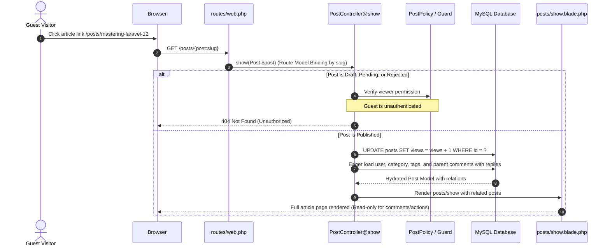

# BlogMNM — Post Display & Reading Flow

## 1. Post Detail Reading Flow



---

## 2. Views Counter Incrementation

To satisfy tracking requirements without race conditions:
```php
$post->increment('views');
```
- **Atomicity**: Executes an atomic SQL statement `UPDATE posts SET views = views + 1 WHERE id = ?`, avoiding race conditions.
- **Accuracy**: Verified by automated test `test_post_detail_increments_views()` confirming counter increments strictly on detail page loads.

---

## 3. Comments Tree Resolution (Read-Only for Guests)

When displaying comments on the article detail page:
1. Only top-level root comments are queried directly:
   ```php
   'comments' => fn ($query) => $query->whereNull('parent_id')
       ->with(['user', 'replies.user'])
       ->latest()
   ```
2. Replies are nested under their respective parent comments, preventing flat or messy thread displays.
3. Guests are greeted with an interactive prompt inviting them to log in or register before submitting replies.

---

## 4. Security & Privacy Boundaries

| State | Guest Viewable? | Author (Owner) | Admin | Response for Guest |
| :--- | :---: | :---: | :---: | :---: |
| **Published** | ✅ Yes | ✅ Yes | ✅ Yes | 200 OK |
| **Draft** | ❌ No | ✅ Yes | ✅ Yes | 404 Not Found |
| **Pending** | ❌ No | ✅ Yes | ✅ Yes | 404 Not Found |
| **Rejected** | ❌ No | ✅ Yes | ✅ Yes | 404 Not Found |

Unpublished articles return **404 Not Found** instead of 403 Forbidden to prevent leaking the existence of sensitive or rejected articles to unauthenticated visitors.
