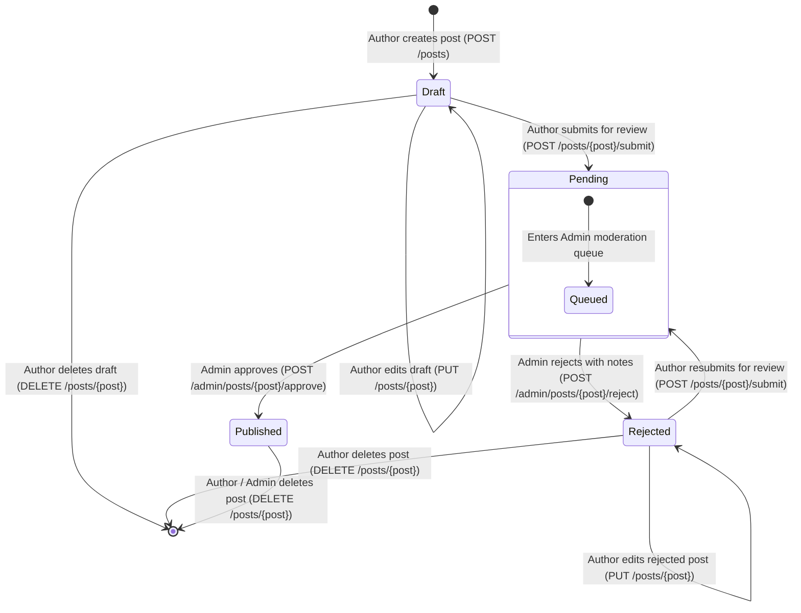

# BlogMNM — Post Lifecycle & Editorial Workflow Specification

## 1. Overview
The BlogMNM post lifecycle implements a strict four-state editorial workflow (`draft`, `pending`, `published`, `rejected`). Authors draft and revise articles, while publication authority is strictly reserved for Administrators. Every transition is protected by role-based authorization, parameter sanitization, and audit trails.

---

## 2. State Machine Diagram



---

## 3. State Definitions & Transitions Matrix

| Initial State | Target State | Triggering Action | Allowed Actor | Endpoint | Security Rules & Audit Fields |
| :--- | :--- | :--- | :--- | :--- | :--- |
| *None* | `draft` | Create Post | Author, Admin | `POST /posts` | Client `status` input stripped; forced to `draft`. Views initialized to `0`. |
| `draft` | `pending` | Submit for Review | Author (Owner) | `POST /posts/{post}/submit` | Guarded by `PostPolicy::submit()`. Clears prior `rejection_reason`. |
| `draft` | `draft` | Update Content | Author (Owner) | `PUT /posts/{post}` | Status changes from payload stripped. Old thumbnail deleted if replaced. |
| `pending` | `published` | Editorial Approval | Admin Only | `POST /admin/posts/{post}/approve` | Sets `published_at = now()`, `reviewed_by = admin.id`, `reviewed_at = now()`. |
| `pending` | `rejected` | Editorial Rejection | Admin Only | `POST /admin/posts/{post}/reject` | Sets `reviewed_by = admin.id`, `reviewed_at = now()`, saves `rejection_reason`. |
| `rejected` | `pending` | Resubmit for Review | Author (Owner) | `POST /posts/{post}/submit` | Restarts review cycle; clears previous rejection feedback. |
| *Any* | *Deleted* | Destroy Post | Author (Owner), Admin | `DELETE /posts/{post}` | Unlinks thumbnail image file from `public` disk via `Post::booted()` hook. |

---

## 4. Input Sanitization & Parameter Tampering Defenses

Authors cannot escalate privileges or publish directly by injecting payload parameters. 

### `StorePostRequest` Pre-Validation Sanitization
```php
protected function prepareForValidation(): void
{
    // Strip untrusted workflow attributes (SEC-02)
    $this->request->remove('status');
    $this->request->remove('published_at');
    $this->request->remove('reviewed_by');
    $this->request->remove('reviewed_at');
    $this->request->remove('views');
}
```

### Explicit State Mutation In Controllers
- `PostController@store`: Hardcodes `'status' => 'draft'`.
- `PostController@update`: Explicitly excludes `status` from fillable updates.
- State changes can only be initiated through dedicated routes:
  - `POST /posts/{id}/submit` $\to$ sets `pending`
  - `POST /admin/posts/{id}/approve` $\to$ sets `published`
  - `POST /admin/posts/{id}/reject` $\to$ sets `rejected`

---

## 5. Storage Lifecycle & Thumbnail Management

Featured post thumbnails are managed with complete file-lifecycle cleanup:
1. **Creation**: Stored in `storage/app/public/thumbnails/{hash}.webp` and referenced as `thumbnails/{hash}.webp` in the database.
2. **Replacement**: When an author uploads a replacement thumbnail, `PostController@update` deletes the old file using `Storage::disk('public')->delete($oldThumbnail)`.
3. **Post Deletion**: The `Post::booted()` model observer ensures that whenever a post is deleted, its thumbnail file is unlinked:
```php
static::deleting(function (Post $post) {
    if ($post->thumbnail && Storage::disk('public')->exists($post->thumbnail)) {
        Storage::disk('public')->delete($post->thumbnail);
    }
});
```
This guarantees zero orphaned image files on disk (`POST-04`, `SEC-06`).
