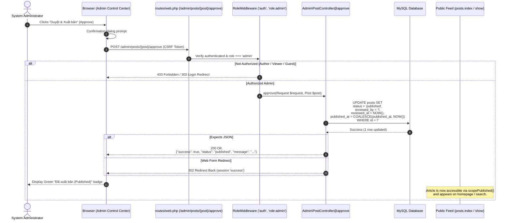

# BlogMNM — Editorial Approval Sequence Specification

## 1. Overview
The Editorial Approval process transitions an article from `pending` review to `published`. During this process, the administrator's ID and current timestamp are recorded for accountability, and the post becomes immediately discoverable in public feeds.

---

## 2. Sequence Diagram



---

## 3. Data Contract Attributes Mutated

```json
{
  "status": "published",
  "reviewed_by": 1,
  "reviewed_at": "2026-09-28T23:45:00.000000Z",
  "published_at": "2026-09-28T23:45:00.000000Z"
}
```
