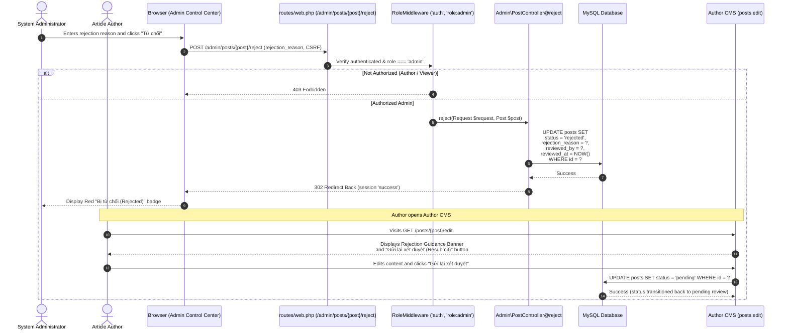

# BlogMNM — Editorial Rejection & Resubmission Sequence Specification

## 1. Overview
The Editorial Rejection process enables an Administrator to return an article to the author with structured feedback. The post status transitions to `rejected`, recording the reviewer ID, timestamp, and explanation. The Author can subsequently edit the post and resubmit it back to `pending`.

---

## 2. Sequence Diagram



---

## 3. Data Contract Attributes Mutated

```json
{
  "status": "rejected",
  "rejection_reason": "Nội dung bài viết chưa đáp ứng tiêu chuẩn biên tập.",
  "reviewed_by": 1,
  "reviewed_at": "2026-09-28T23:45:00.000000Z"
}
```
