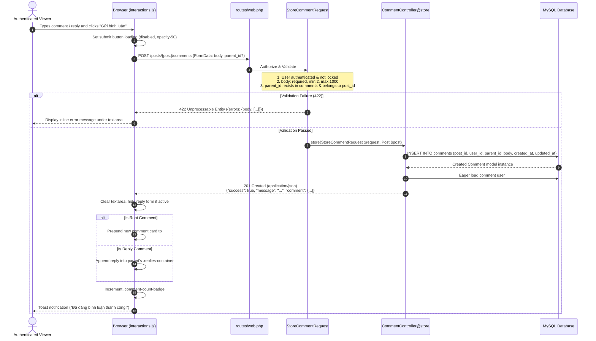

# BlogMNM — Comment & Reply Sequence Specification

## 1. Overview
The Comment feature allows authenticated Viewers to post comments on published articles and reply to existing comments in a nested thread structure. Parent ID validation prevents cross-post reply attacks.



---

## 2. API Contract & Validation Rules

- **Endpoint**: `POST /posts/{post}/comments`
- **Headers**:
  - `X-CSRF-TOKEN`: `<csrf-token>`
  - `Accept`: `application/json`
- **Parameters**:
  - `body`: `string` (required, 2-1000 chars)
  - `parent_id`: `integer` (nullable, must reference a comment belonging to the same `post_id`)
- **Success Response (201 Created)**:
  ```json
  {
    "success": true,
    "message": "Comment posted successfully.",
    "comment": {
      "id": 105,
      "post_id": 12,
      "parent_id": 4,
      "body": "Thank you for the detailed breakdown!",
      "user_name": "Minh Khoi",
      "user_avatar": null,
      "created_at": "1 second ago"
    }
  }
  ```

---

## 3. Parent ID Security Verification
In `StoreCommentRequest::withValidator()`:
- If `parent_id` is passed, the parent comment is retrieved from the database.
- The request verifies `$parentComment->post_id === $post->id`.
- If a user tries to inject a `parent_id` from a different article, validation rejects the request immediately with HTTP 422.
