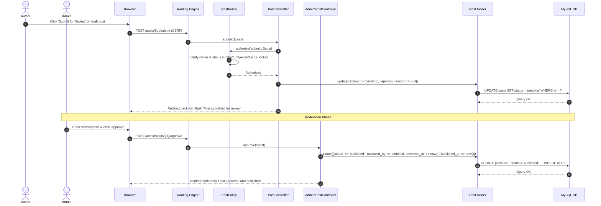
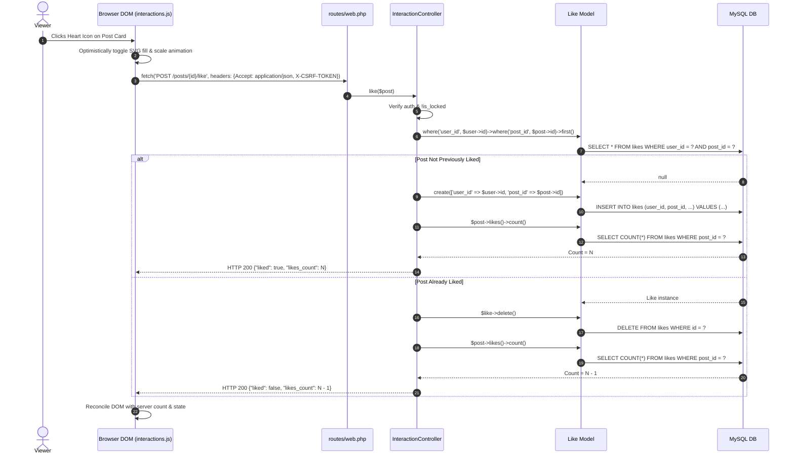
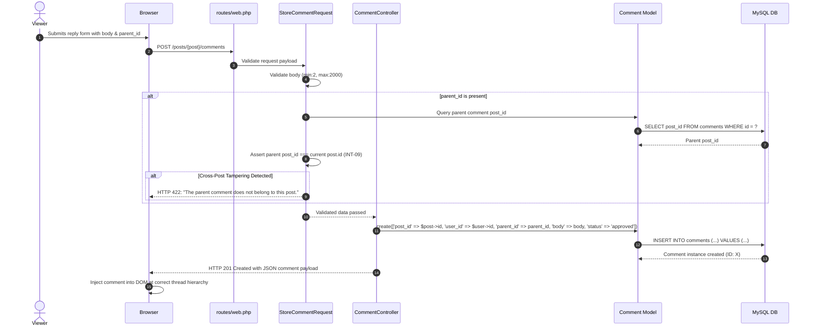
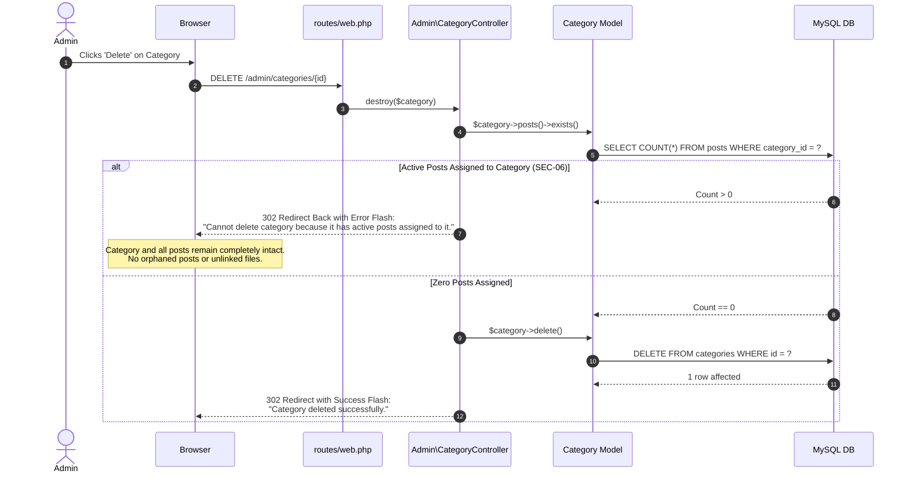

# BlogMNM — Master Sequence Diagrams

This document consolidates UML Sequence Diagrams detailing the exact messaging patterns, lifecycle hooks, and database transactions across the platform's core operational flows.

---

## 1. Sequence Diagram: Post Submission, Review & Publication

---

## 2. Sequence Diagram: Optimistic AJAX Social Interactions (Like Toggle)

---

## 3. Sequence Diagram: Threaded Commenting & Anti-Cross-Posting Validation

---

## 4. Sequence Diagram: Category Deletion Protection (`RESTRICT`)

