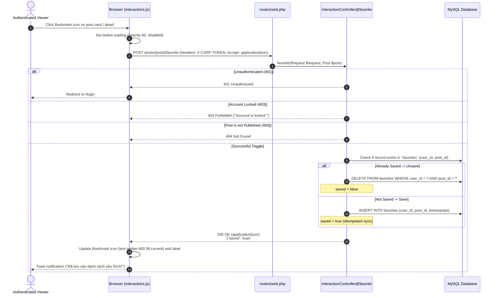

# BlogMNM — Favorite Interaction Sequence Specification

## 1. Overview
The Favorite feature allows authenticated Viewers to bookmark articles for later reading. The action operates asynchronously via `fetch()` and updates UI elements seamlessly.



---

## 2. API Contract & Response Format

- **Endpoint**: `POST /posts/{post}/favorite`
- **Headers**:
  - `X-CSRF-TOKEN`: `<csrf-token>`
  - `Accept`: `application/json`
  - `Content-Type`: `application/json`
- **Success Response Payload (Exact)**:
  ```json
  {
    "saved": true
  }
  ```
  *(Or when un-favoriting: `{ "saved": false }`)*

---

## 3. Dedicated Favorites Page (`GET /favorites`)
- **Route**: `favorites.index`
- **Controller**: `FavoriteController@index`
- **Functionality**:
  - Retrieves all posts favorited by `Auth::user()` using `favoritePosts()`.
  - Filters strictly to `published()` posts.
  - Eager-loads `user`, `category`, `tags`, and counts to eliminate N+1 queries.
  - Paginates results (9 items per page) with query string preservation.
