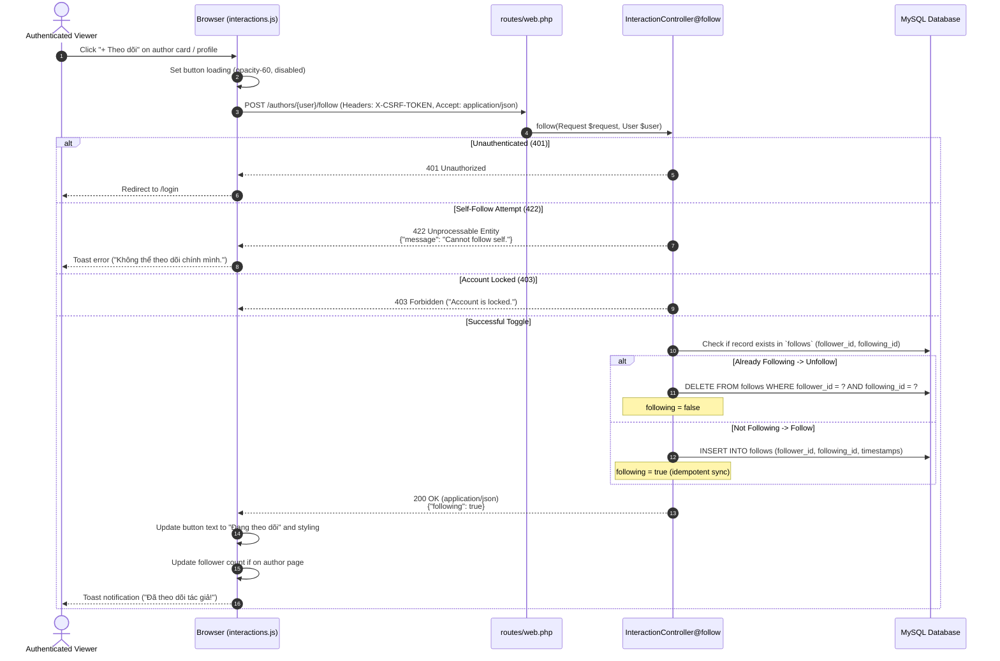

# BlogMNM — Follow Author Sequence Specification

## 1. Overview
The Follow feature allows authenticated Viewers to subscribe to authors. Authors cannot follow themselves. The interaction executes asynchronously via `fetch()` and updates UI elements without a page refresh.



---

## 2. API Contract & Response Format

- **Endpoint**: `POST /authors/{user}/follow`
- **Headers**:
  - `X-CSRF-TOKEN`: `<csrf-token>`
  - `Accept`: `application/json`
  - `Content-Type`: `application/json`
- **Success Response Payload (Exact)**:
  ```json
  {
    "following": true
  }
  ```
  *(Or when unfollowing: `{ "following": false }`)*
- **Self-Follow Error Response (422)**:
  ```json
  {
    "message": "Cannot follow self."
  }
  ```

---

## 3. Database Constraints
- Unique pair enforced at database level: `UNIQUE KEY ('follower_id', 'following_id')`.
- Cascade deletion: If an author or user is deleted, all their following/follower associations are removed automatically.
