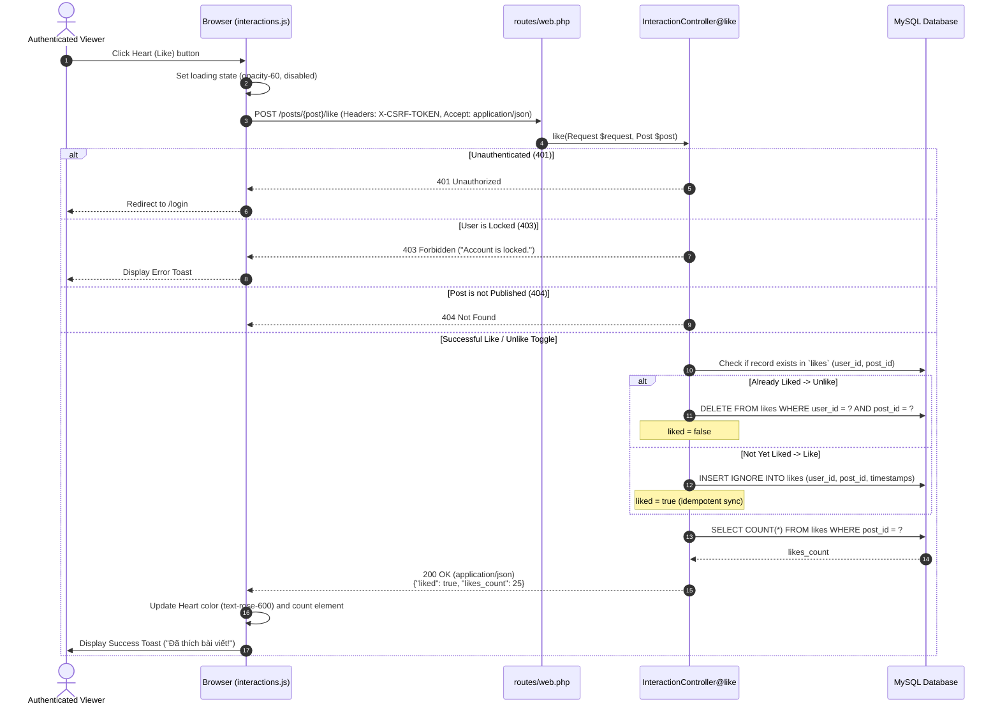

# BlogMNM — Like Interaction Sequence Specification

## 1. Overview
The Like feature allows authenticated Viewers to endorse published articles via asynchronous AJAX requests (`fetch()`). The UI toggles state smoothly without a full page reload, and concurrent duplicate like requests are handled idempotently.



---

## 2. API Contract & Response Format

- **Endpoint**: `POST /posts/{post}/like`
- **Headers**:
  - `X-CSRF-TOKEN`: `<csrf-token>`
  - `Accept`: `application/json`
  - `Content-Type`: `application/json`
- **Success Response Payload (Exact)**:
  ```json
  {
    "liked": true,
    "likes_count": 25
  }
  ```
  *(Or when unliking: `{ "liked": false, "likes_count": 24 }`)*

---

## 3. Concurrency & Duplicate Like Protection
- Database schema enforces a composite unique key: `UNIQUE KEY ('user_id', 'post_id')`.
- Controller uses Eloquent `syncWithoutDetaching([$user->id])` when adding likes, ensuring race conditions never result in SQL duplicate key exceptions or inflated like counts.
