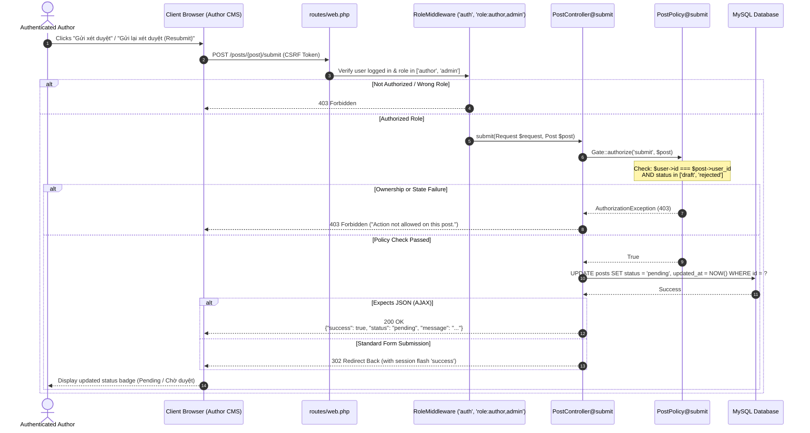

# BlogMNM — Post Submission & Resubmission Sequence Specification

## 1. Overview
The Post Submission flow enables an author to transition an article from `draft` or `rejected` to `pending` review. This sequence enforces authorization via `PostPolicy@submit` to guarantee that only the post owner can submit their own work, and only from valid pre-review states.

---

## 2. Sequence Diagram



---

## 3. Policy Specification (`PostPolicy@submit`)

```php
public function submit(User $user, Post $post): bool
{
    // 1. Author must be the creator of the post
    // 2. Post status must currently be 'draft' or 'rejected'
    return $user->id === $post->user_id
        && in_array($post->status, ['draft', 'rejected'], true);
}
```

- **Draft -> Pending**: Initial review submission after drafting.
- **Rejected -> Pending**: Editorial revision submission after addressing feedback.
- **Pending / Published**: Submitting is blocked (returns `403`), preventing race conditions or duplicate reviews.
