# BlogMNM — System Use Case Specifications

## 1. System Use Case Diagram

```mermaid
flowchart LR
    %% Actors
    Guest([Guest])
    Viewer([Viewer])
    Author([Author])
    Admin([Administrator])

    %% Inheritance
    Viewer -- extends --> Guest
    Author -- extends --> Viewer
    Admin -- extends --> Author

    subgraph Discovery ["Public Content & Discovery"]
        UC01(UC-01: Browse Home Feed)
        UC02(UC-02: Search Articles)
        UC03(UC-03: Filter by Category / Tag)
        UC04(UC-04: Read Post & Increment Views)
        UC05(UC-05: View Author Profile)
        UC06(UC-06: Toggle Theme)
        UC07(UC-07: Register & Authenticate)
    end

    subgraph Social ["Viewer Social Engagement"]
        UC08(UC-08: Like / Unlike Post)
        UC09(UC-09: Bookmark / Favorite Post)
        UC10(UC-10: View Favorites Library)
        UC11(UC-11: Follow / Unfollow Author)
        UC12(UC-12: Post Root Comment)
        UC13(UC-13: Reply to Comment)
        UC14(UC-14: Manage User Profile)
    end

    subgraph Editorial ["Author Editorial CMS"]
        UC15(UC-15: Create Draft Post)
        UC16(UC-16: Upload & Replace Thumbnail)
        UC17(UC-17: Edit & Update Own Post)
        UC18(UC-18: Submit Post for Review)
        UC19(UC-19: Delete Own Post)
        UC20(UC-20: View Author Performance Stats)
    end

    subgraph Governance ["Administrator Moderation & Governance"]
        UC21(UC-21: Review & Approve / Reject Post)
        UC22(UC-22: Moderate Comments)
        UC23(UC-23: Manage Categories)
        UC24(UC-24: Lock / Unlock Abusive Users)
        UC25(UC-25: Monitor Platform Analytics)
    end

    %% Associations
    Guest --> Discovery
    Viewer --> Social
    Author --> Editorial
    Admin --> Governance
```

---

## 2. Use Case Directory

### 2.1 Content Discovery & Public Access (Guest + All Roles)

| UC ID | Name | Primary Actor | Trigger | Primary Endpoint |
| :--- | :--- | :--- | :--- | :--- |
| **UC-01** | Browse Home Feed | Guest | Visits `/` or `/posts` | `GET /` |
| **UC-02** | Search Articles | Guest | Submits query in search bar | `GET /posts?q={keyword}` |
| **UC-03** | Filter by Category / Tag | Guest | Clicks category or tag pill | `GET /posts?category={slug}` |
| **UC-04** | Read Post & Track Views | Guest | Clicks post card in feed | `GET /posts/{slug}` |
| **UC-05** | View Author Profile | Guest | Clicks author name/avatar | `GET /authors/{user}` |
| **UC-06** | Toggle Light / Dark Theme | Guest | Clicks theme toggle icon | Client-side script / localStorage |
| **UC-07** | Register / Login / Logout | Guest | Submits auth form | `POST /register`, `POST /login` |

### 2.2 Social Engagement (Viewer + Author + Admin)

| UC ID | Name | Primary Actor | Trigger | Primary Endpoint |
| :--- | :--- | :--- | :--- | :--- |
| **UC-08** | Like / Unlike Post | Viewer | Clicks heart icon on post | `POST /posts/{id}/like` |
| **UC-09** | Bookmark / Favorite Post | Viewer | Clicks bookmark icon | `POST /posts/{id}/favorite` |
| **UC-10** | View Favorites Library | Viewer | Navigates to `/favorites` | `GET /favorites` |
| **UC-11** | Follow / Unfollow Author | Viewer | Clicks "Follow" on author profile | `POST /authors/{user}/follow` |
| **UC-12** | Post Root Comment | Viewer | Submits comment form on post | `POST /posts/{id}/comments` |
| **UC-13** | Reply to Comment | Viewer | Clicks "Reply" and submits | `POST /posts/{id}/comments` (`parent_id`) |
| **UC-14** | Manage Profile & Password | Viewer | Visits `/profile` settings | `PATCH /profile`, `PUT /password` |

### 2.3 Author Editorial CMS (Author + Admin)

| UC ID | Name | Primary Actor | Trigger | Primary Endpoint |
| :--- | :--- | :--- | :--- | :--- |
| **UC-15** | Create Draft Post | Author | Clicks "New Post" / submits form | `POST /posts` |
| **UC-16** | Upload / Replace Thumbnail | Author | Drops image file in upload box | `POST /posts` or `PUT /posts/{id}` |
| **UC-17** | Edit & Update Post | Author | Modifies content on `/posts/{id}/edit` | `PUT /posts/{id}` |
| **UC-18** | Submit Post for Review | Author | Clicks "Submit for Review" | `POST /posts/{id}/submit` |
| **UC-19** | Delete Own Post | Author | Confirms post deletion | `DELETE /posts/{id}` |
| **UC-20** | View Author Portfolio Stats| Author | Navigates to Author dashboard | `GET /author/posts/stats` |

### 2.4 Governance & Moderation (Administrator Only)

| UC ID | Name | Primary Actor | Trigger | Primary Endpoint |
| :--- | :--- | :--- | :--- | :--- |
| **UC-21a**| Approve Pending Post | Admin | Clicks "Approve" in review queue | `POST /admin/posts/{id}/approve` |
| **UC-21b**| Reject Pending Post | Admin | Enters reason and clicks "Reject" | `POST /admin/posts/{id}/reject` |
| **UC-22a**| Approve Comment | Admin | Clicks "Approve" in comment queue | `POST /admin/comments/{id}/approve` |
| **UC-22b**| Mark Comment as Spam | Admin | Clicks "Spam" on suspect comment | `POST /admin/comments/{id}/spam` |
| **UC-22c**| Delete Comment | Admin | Clicks "Delete" on comment | `DELETE /admin/comments/{id}` |
| **UC-23** | Manage Categories | Admin | Creates, edits, or deletes category | `POST/PUT/DELETE /admin/categories` |
| **UC-24** | Lock / Unlock User Account | Admin | Toggles user lock status in user table | `POST /admin/users/{user}/lock` |
| **UC-25** | Monitor Platform Metrics | Admin | Visits Admin portal dashboard | `GET /admin` |
